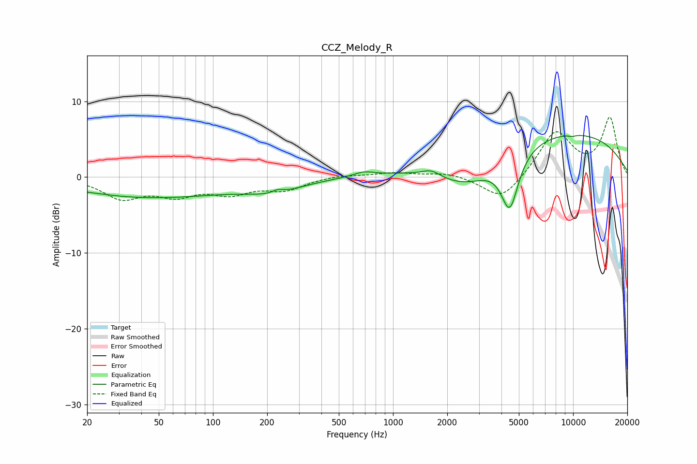

# CCZ_Melody_R
See [usage instructions](https://github.com/jaakkopasanen/AutoEq#usage) for more options and info.

### Parametric EQs
Apply preamp of -5.6 dB when using parametric equalizer.

|   # | Type    |   Fc (Hz) |    Q |   Gain (dB) |
|-----|---------|-----------|------|-------------|
|   1 | Peaking |        21 | 1.26 |         0.1 |
|   2 | Peaking |        43 | 0.3  |        -2.7 |
|   3 | Peaking |       218 | 0.92 |        -1.4 |
|   4 | Peaking |       229 | 4.65 |         0.5 |
|   5 | Peaking |       688 | 2.6  |         0.6 |
|   6 | Peaking |      1633 | 2.86 |         0.9 |
|   7 | Peaking |      2576 | 0.74 |        -5   |
|   8 | Peaking |      4450 | 2.86 |        -7.3 |
|   9 | Peaking |      7002 | 0.21 |         6.5 |
|  10 | Peaking |      9886 | 6    |        -0.2 |

### Fixed Band EQs
When using fixed band (also called graphic) equalizer, apply preamp of **-8.0 dB** (if available) and set gains manually with these parameters.

|   # | Type    |   Fc (Hz) |    Q |   Gain (dB) |
|-----|---------|-----------|------|-------------|
|   1 | Peaking |        31 | 1.41 |        -2.6 |
|   2 | Peaking |        62 | 1.41 |        -2.1 |
|   3 | Peaking |       125 | 1.41 |        -1.9 |
|   4 | Peaking |       250 | 1.41 |        -1.5 |
|   5 | Peaking |       500 | 1.41 |         0.3 |
|   6 | Peaking |      1000 | 1.41 |         0.6 |
|   7 | Peaking |      2000 | 1.41 |         0.6 |
|   8 | Peaking |      4000 | 1.41 |        -3.2 |
|   9 | Peaking |      8000 | 1.41 |         6   |
|  10 | Peaking |     16000 | 1.41 |         7.7 |

### Graphs

