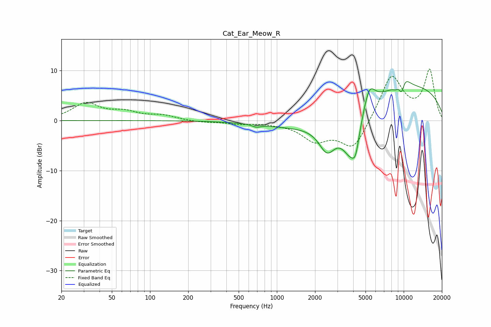

# Cat_Ear_Meow_R
See [usage instructions](https://github.com/jaakkopasanen/AutoEq#usage) for more options and info.

### Parametric EQs
Apply preamp of -7.9 dB when using parametric equalizer.

|   # | Type    |   Fc (Hz) |    Q |   Gain (dB) |
|-----|---------|-----------|------|-------------|
|   1 | Peaking |       689 | 4.45 |        -0.5 |
|   2 | Peaking |      2134 | 0.4  |        -2.4 |
|   3 | Peaking |      2487 | 2.16 |        -5.2 |
|   4 | Peaking |      3847 | 1.89 |        -8.5 |
|   5 | Peaking |      4181 | 5.29 |        -3.4 |
|   6 | Peaking |      5343 | 2.96 |         4.9 |
|   7 | Peaking |      8624 | 6    |        -0.5 |
|   8 | Peaking |      9641 | 5.83 |        -2.8 |
|   9 | Peaking |      9996 | 0.24 |         7.2 |
|  10 | Peaking |     10000 | 2.68 |         2.4 |

### Fixed Band EQs
When using fixed band (also called graphic) equalizer, apply preamp of **-10.4 dB** (if available) and set gains manually with these parameters.

|   # | Type    |   Fc (Hz) |    Q |   Gain (dB) |
|-----|---------|-----------|------|-------------|
|   1 | Peaking |        31 | 1.41 |         3.3 |
|   2 | Peaking |        62 | 1.41 |         1.5 |
|   3 | Peaking |       125 | 1.41 |         0.9 |
|   4 | Peaking |       250 | 1.41 |        -0.3 |
|   5 | Peaking |       500 | 1.41 |        -0.6 |
|   6 | Peaking |      1000 | 1.41 |        -0.3 |
|   7 | Peaking |      2000 | 1.41 |        -3.7 |
|   8 | Peaking |      4000 | 1.41 |        -5.9 |
|   9 | Peaking |      8000 | 1.41 |         9.2 |
|  10 | Peaking |     16000 | 1.41 |         9.9 |

### Graphs

