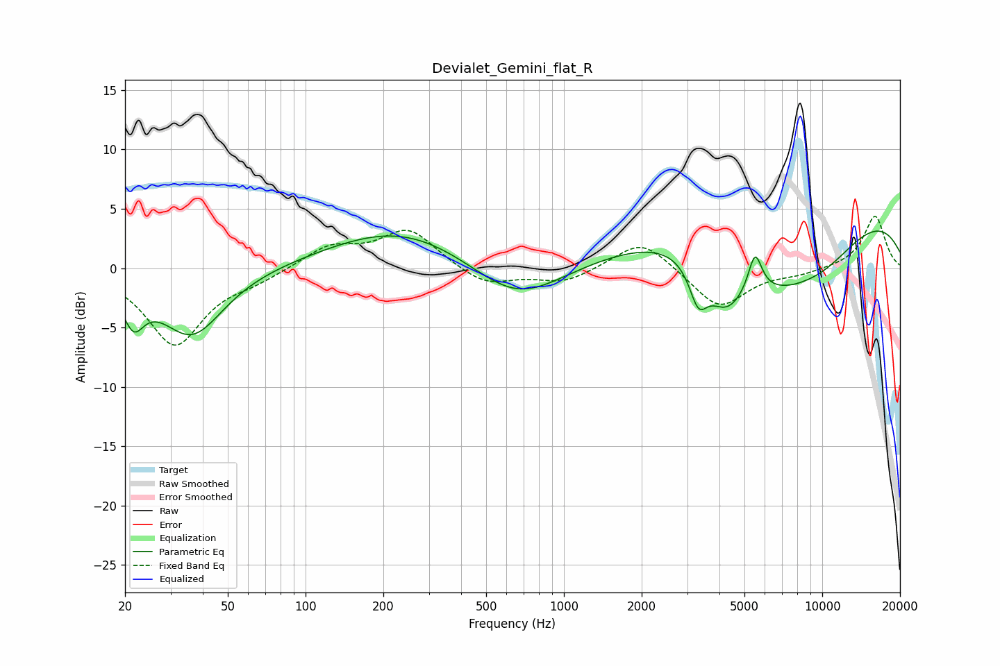

# Devialet_Gemini_flat_R
See [usage instructions](https://github.com/jaakkopasanen/AutoEq#usage) for more options and info.

### Parametric EQs
Apply preamp of -3.2 dB when using parametric equalizer.

|   # | Type    |   Fc (Hz) |    Q |   Gain (dB) |
|-----|---------|-----------|------|-------------|
|   1 | Peaking |        22 | 3.48 |        -3.2 |
|   2 | Peaking |        36 | 1.15 |        -5.7 |
|   3 | Peaking |       236 | 0.51 |         3.4 |
|   4 | Peaking |       656 | 0.8  |        -3.6 |
|   5 | Peaking |      3313 | 4.07 |        -3.1 |
|   6 | Peaking |      4231 | 1.62 |        -4.9 |
|   7 | Peaking |      5495 | 5.35 |         3.2 |
|   8 | Peaking |      6607 | 0.86 |        -3.6 |
|   9 | Peaking |      8789 | 0.18 |         5.7 |
|  10 | Peaking |      9776 | 0.7  |        -3.8 |

### Fixed Band EQs
When using fixed band (also called graphic) equalizer, apply preamp of **-4.5 dB** (if available) and set gains manually with these parameters.

|   # | Type    |   Fc (Hz) |    Q |   Gain (dB) |
|-----|---------|-----------|------|-------------|
|   1 | Peaking |        31 | 1.41 |        -6.4 |
|   2 | Peaking |        62 | 1.41 |        -0.8 |
|   3 | Peaking |       125 | 1.41 |         1.8 |
|   4 | Peaking |       250 | 1.41 |         3.2 |
|   5 | Peaking |       500 | 1.41 |        -1.5 |
|   6 | Peaking |      1000 | 1.41 |        -1.2 |
|   7 | Peaking |      2000 | 1.41 |         2.6 |
|   8 | Peaking |      4000 | 1.41 |        -3.4 |
|   9 | Peaking |      8000 | 1.41 |        -0.4 |
|  10 | Peaking |     16000 | 1.41 |         4.4 |

### Graphs

