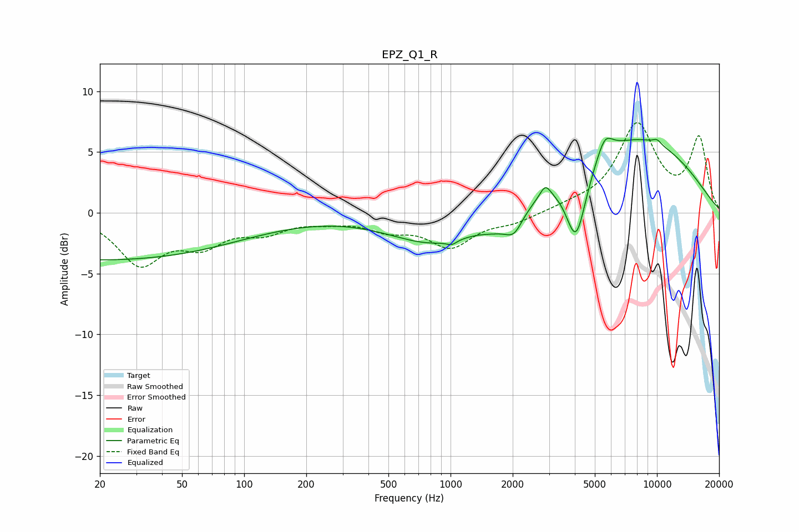

# EPZ_Q1_R
See [usage instructions](https://github.com/jaakkopasanen/AutoEq#usage) for more options and info.

### Parametric EQs
Apply preamp of -6.2 dB when using parametric equalizer.

|   # | Type    |   Fc (Hz) |    Q |   Gain (dB) |
|-----|---------|-----------|------|-------------|
|   1 | Peaking |        20 | 0.19 |        -3.9 |
|   2 | Peaking |       839 | 0.65 |        -2.6 |
|   3 | Peaking |      1014 | 5.88 |        -0.3 |
|   4 | Peaking |      1726 | 1.52 |        -1.2 |
|   5 | Peaking |      2036 | 3.37 |        -1.5 |
|   6 | Peaking |      2878 | 5.34 |         1.1 |
|   7 | Peaking |      4056 | 2.85 |        -5.9 |
|   8 | Peaking |      5589 | 3.68 |         1.7 |
|   9 | Peaking |      7747 | 0.38 |         6.2 |
|  10 | Peaking |     10000 | 6    |         0.4 |

### Fixed Band EQs
When using fixed band (also called graphic) equalizer, apply preamp of **-7.5 dB** (if available) and set gains manually with these parameters.

|   # | Type    |   Fc (Hz) |    Q |   Gain (dB) |
|-----|---------|-----------|------|-------------|
|   1 | Peaking |        31 | 1.41 |        -4   |
|   2 | Peaking |        62 | 1.41 |        -2.2 |
|   3 | Peaking |       125 | 1.41 |        -1.3 |
|   4 | Peaking |       250 | 1.41 |        -0.5 |
|   5 | Peaking |       500 | 1.41 |        -1.2 |
|   6 | Peaking |      1000 | 1.41 |        -2.6 |
|   7 | Peaking |      2000 | 1.41 |        -0.7 |
|   8 | Peaking |      4000 | 1.41 |         0.4 |
|   9 | Peaking |      8000 | 1.41 |         7.1 |
|  10 | Peaking |     16000 | 1.41 |         6   |

### Graphs

