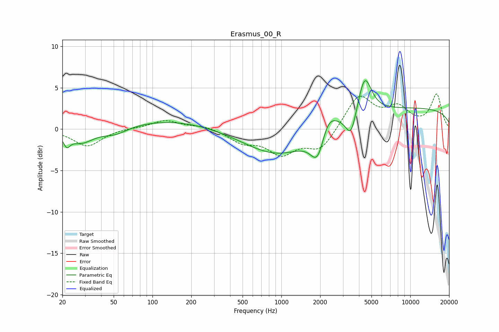

# Erasmus_00_R
See [usage instructions](https://github.com/jaakkopasanen/AutoEq#usage) for more options and info.

### Parametric EQs
Apply preamp of -5.9 dB when using parametric equalizer.

|   # | Type    |   Fc (Hz) |    Q |   Gain (dB) |
|-----|---------|-----------|------|-------------|
|   1 | Peaking |        22 | 5.93 |        -1.2 |
|   2 | Peaking |        28 | 1.43 |        -1.7 |
|   3 | Peaking |        52 | 1.48 |        -0.8 |
|   4 | Peaking |       139 | 0.41 |         1.1 |
|   5 | Peaking |       961 | 0.54 |        -3.3 |
|   6 | Peaking |      1925 | 2.5  |        -4.2 |
|   7 | Peaking |      2262 | 2.09 |         2.9 |
|   8 | Peaking |      3473 | 3.47 |        -3.1 |
|   9 | Peaking |      4423 | 2.67 |         4.8 |
|  10 | Peaking |     10000 | 0.19 |         2.5 |

### Fixed Band EQs
When using fixed band (also called graphic) equalizer, apply preamp of **-4.3 dB** (if available) and set gains manually with these parameters.

|   # | Type    |   Fc (Hz) |    Q |   Gain (dB) |
|-----|---------|-----------|------|-------------|
|   1 | Peaking |        31 | 1.41 |        -2.1 |
|   2 | Peaking |        62 | 1.41 |         0.1 |
|   3 | Peaking |       125 | 1.41 |         1.1 |
|   4 | Peaking |       250 | 1.41 |         0.4 |
|   5 | Peaking |       500 | 1.41 |        -1.4 |
|   6 | Peaking |      1000 | 1.41 |        -2.8 |
|   7 | Peaking |      2000 | 1.41 |        -2.5 |
|   8 | Peaking |      4000 | 1.41 |         4.1 |
|   9 | Peaking |      8000 | 1.41 |         2.3 |
|  10 | Peaking |     16000 | 1.41 |         4.1 |

### Graphs

