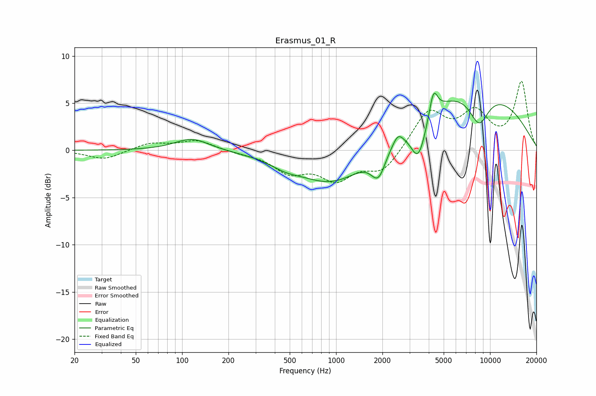

# Erasmus_01_R
See [usage instructions](https://github.com/jaakkopasanen/AutoEq#usage) for more options and info.

### Parametric EQs
Apply preamp of -6.2 dB when using parametric equalizer.

|   # | Type    |   Fc (Hz) |    Q |   Gain (dB) |
|-----|---------|-----------|------|-------------|
|   1 | Peaking |       116 | 1.29 |         1.3 |
|   2 | Peaking |       464 | 1.54 |        -0.6 |
|   3 | Peaking |       971 | 0.62 |        -3.9 |
|   4 | Peaking |      1885 | 2.9  |        -3   |
|   5 | Peaking |      2171 | 3.53 |         0   |
|   6 | Peaking |      2519 | 4.58 |         1   |
|   7 | Peaking |      3427 | 2.74 |        -4.5 |
|   8 | Peaking |      4289 | 5.3  |         2.8 |
|   9 | Peaking |      7484 | 0.32 |         6.8 |
|  10 | Peaking |      8483 | 1.99 |        -3.6 |

### Fixed Band EQs
When using fixed band (also called graphic) equalizer, apply preamp of **-7.4 dB** (if available) and set gains manually with these parameters.

|   # | Type    |   Fc (Hz) |    Q |   Gain (dB) |
|-----|---------|-----------|------|-------------|
|   1 | Peaking |        31 | 1.41 |        -1   |
|   2 | Peaking |        62 | 1.41 |         0.8 |
|   3 | Peaking |       125 | 1.41 |         1.1 |
|   4 | Peaking |       250 | 1.41 |        -0.2 |
|   5 | Peaking |       500 | 1.41 |        -2.1 |
|   6 | Peaking |      1000 | 1.41 |        -2.8 |
|   7 | Peaking |      2000 | 1.41 |        -2.3 |
|   8 | Peaking |      4000 | 1.41 |         4.1 |
|   9 | Peaking |      8000 | 1.41 |         3.6 |
|  10 | Peaking |     16000 | 1.41 |         7.1 |

### Graphs

