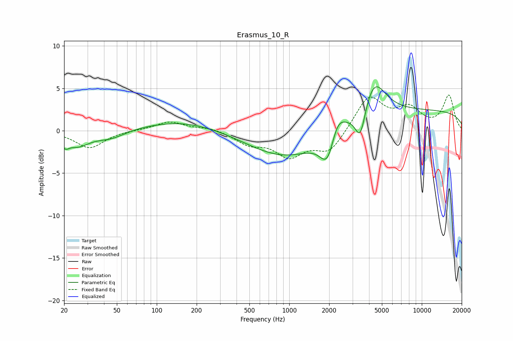

# Erasmus_10_R
See [usage instructions](https://github.com/jaakkopasanen/AutoEq#usage) for more options and info.

### Parametric EQs
Apply preamp of -5.3 dB when using parametric equalizer.

|   # | Type    |   Fc (Hz) |    Q |   Gain (dB) |
|-----|---------|-----------|------|-------------|
|   1 | Peaking |        20 | 5.07 |        -1   |
|   2 | Peaking |        25 | 1.57 |        -1.6 |
|   3 | Peaking |        45 | 1.28 |        -0.9 |
|   4 | Peaking |       159 | 0.48 |         1.2 |
|   5 | Peaking |       964 | 0.49 |        -3.3 |
|   6 | Peaking |      1955 | 2.48 |        -3.9 |
|   7 | Peaking |      2292 | 2.51 |         2.7 |
|   8 | Peaking |      3439 | 3.62 |        -3.8 |
|   9 | Peaking |      4334 | 1.6  |         4.5 |
|  10 | Peaking |     10000 | 0.18 |         2.4 |

### Fixed Band EQs
When using fixed band (also called graphic) equalizer, apply preamp of **-4.3 dB** (if available) and set gains manually with these parameters.

|   # | Type    |   Fc (Hz) |    Q |   Gain (dB) |
|-----|---------|-----------|------|-------------|
|   1 | Peaking |        31 | 1.41 |        -2   |
|   2 | Peaking |        62 | 1.41 |         0.1 |
|   3 | Peaking |       125 | 1.41 |         1.1 |
|   4 | Peaking |       250 | 1.41 |         0.4 |
|   5 | Peaking |       500 | 1.41 |        -1.4 |
|   6 | Peaking |      1000 | 1.41 |        -2.8 |
|   7 | Peaking |      2000 | 1.41 |        -2.5 |
|   8 | Peaking |      4000 | 1.41 |         4.1 |
|   9 | Peaking |      8000 | 1.41 |         2.4 |
|  10 | Peaking |     16000 | 1.41 |         4.1 |

### Graphs

