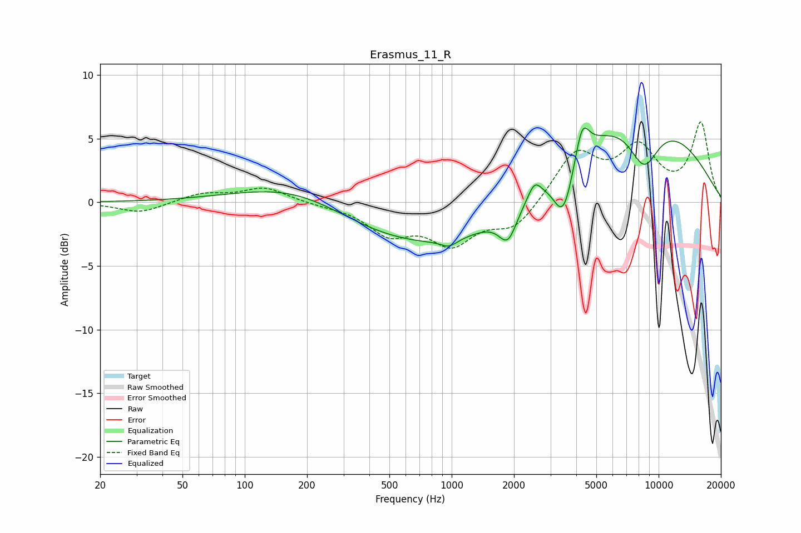

# Erasmus_11_R
See [usage instructions](https://github.com/jaakkopasanen/AutoEq#usage) for more options and info.

### Parametric EQs
Apply preamp of -5.9 dB when using parametric equalizer.

|   # | Type    |   Fc (Hz) |    Q |   Gain (dB) |
|-----|---------|-----------|------|-------------|
|   1 | Peaking |       197 | 0.49 |         3.2 |
|   2 | Peaking |       591 | 0.59 |         0.4 |
|   3 | Peaking |       602 | 0.27 |        -4.7 |
|   4 | Peaking |       970 | 3.64 |        -0.6 |
|   5 | Peaking |      1872 | 3.21 |        -2.4 |
|   6 | Peaking |      2513 | 4.59 |         1.2 |
|   7 | Peaking |      3471 | 2.84 |        -4.3 |
|   8 | Peaking |      4270 | 4.21 |         2.8 |
|   9 | Peaking |      7503 | 0.34 |         7.2 |
|  10 | Peaking |      8509 | 1.76 |        -3.8 |

### Fixed Band EQs
When using fixed band (also called graphic) equalizer, apply preamp of **-6.4 dB** (if available) and set gains manually with these parameters.

|   # | Type    |   Fc (Hz) |    Q |   Gain (dB) |
|-----|---------|-----------|------|-------------|
|   1 | Peaking |        31 | 1.41 |        -0.8 |
|   2 | Peaking |        62 | 1.41 |         0.7 |
|   3 | Peaking |       125 | 1.41 |         1.1 |
|   4 | Peaking |       250 | 1.41 |        -0.2 |
|   5 | Peaking |       500 | 1.41 |        -2.3 |
|   6 | Peaking |      1000 | 1.41 |        -3   |
|   7 | Peaking |      2000 | 1.41 |        -2   |
|   8 | Peaking |      4000 | 1.41 |         3.8 |
|   9 | Peaking |      8000 | 1.41 |         4   |
|  10 | Peaking |     16000 | 1.41 |         6.1 |

### Graphs

