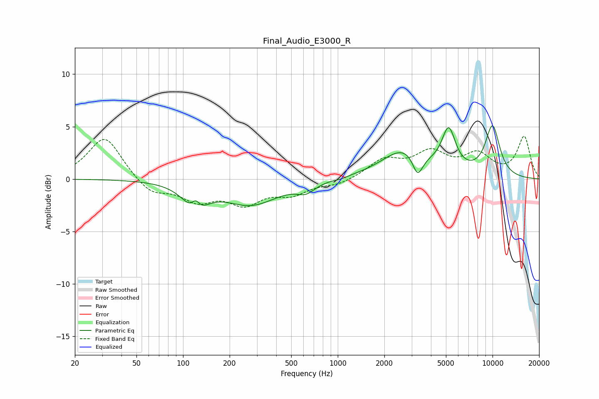

# Final_Audio_E3000_R
See [usage instructions](https://github.com/jaakkopasanen/AutoEq#usage) for more options and info.

### Parametric EQs
Apply preamp of -5.2 dB when using parametric equalizer.

|   # | Type    |   Fc (Hz) |    Q |   Gain (dB) |
|-----|---------|-----------|------|-------------|
|   1 | Peaking |       120 | 1.93 |        -2.5 |
|   2 | Peaking |       121 | 5.29 |         1.1 |
|   3 | Peaking |       275 | 0.81 |        -2.3 |
|   4 | Peaking |       623 | 2.46 |        -0.9 |
|   5 | Peaking |      1048 | 4.07 |        -0.1 |
|   6 | Peaking |      2702 | 0.98 |         2.8 |
|   7 | Peaking |      3278 | 4.27 |        -2.1 |
|   8 | Peaking |      3618 | 5.22 |        -0.1 |
|   9 | Peaking |      5207 | 3.15 |         3.9 |
|  10 | Peaking |     10000 | 2.51 |         4.8 |

### Fixed Band EQs
When using fixed band (also called graphic) equalizer, apply preamp of **-4.2 dB** (if available) and set gains manually with these parameters.

|   # | Type    |   Fc (Hz) |    Q |   Gain (dB) |
|-----|---------|-----------|------|-------------|
|   1 | Peaking |        31 | 1.41 |         4.1 |
|   2 | Peaking |        62 | 1.41 |        -1.5 |
|   3 | Peaking |       125 | 1.41 |        -1.9 |
|   4 | Peaking |       250 | 1.41 |        -2.1 |
|   5 | Peaking |       500 | 1.41 |        -1.3 |
|   6 | Peaking |      1000 | 1.41 |        -0.5 |
|   7 | Peaking |      2000 | 1.41 |         1.7 |
|   8 | Peaking |      4000 | 1.41 |         2.3 |
|   9 | Peaking |      8000 | 1.41 |         2.1 |
|  10 | Peaking |     16000 | 1.41 |         4   |

### Graphs

