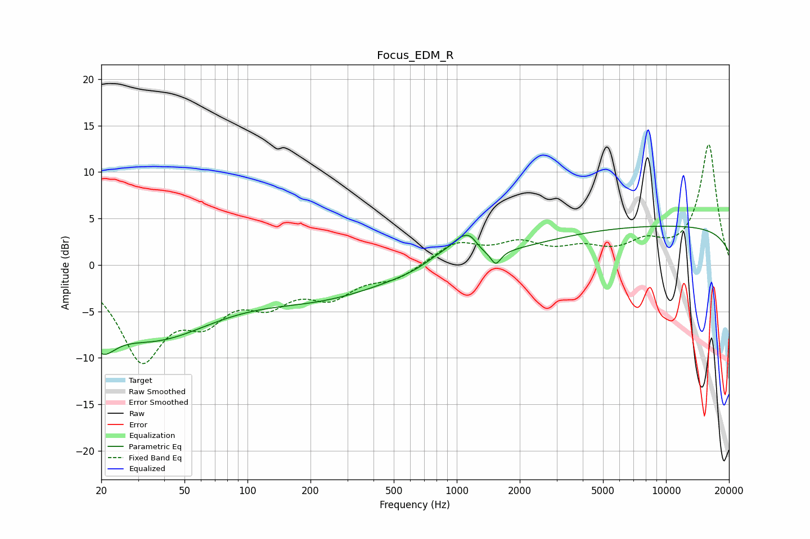

# Focus_EDM_R
See [usage instructions](https://github.com/jaakkopasanen/AutoEq#usage) for more options and info.

### Parametric EQs
Apply preamp of -4.3 dB when using parametric equalizer.

|   # | Type    |   Fc (Hz) |    Q |   Gain (dB) |
|-----|---------|-----------|------|-------------|
|   1 | Peaking |        20 | 2.19 |        -3.7 |
|   2 | Peaking |        35 | 0.45 |        -7.4 |
|   3 | Peaking |       225 | 0.45 |        -3.1 |
|   4 | Peaking |       823 | 1.86 |         1   |
|   5 | Peaking |      1060 | 2.31 |         3.1 |
|   6 | Peaking |      1096 | 1.8  |        -1.3 |
|   7 | Peaking |      1167 | 4.08 |         1.1 |
|   8 | Peaking |      1511 | 5.93 |         1.7 |
|   9 | Peaking |      1523 | 5.85 |        -3.1 |
|  10 | Peaking |     10000 | 0.18 |         4.2 |

### Fixed Band EQs
When using fixed band (also called graphic) equalizer, apply preamp of **-13.0 dB** (if available) and set gains manually with these parameters.

|   # | Type    |   Fc (Hz) |    Q |   Gain (dB) |
|-----|---------|-----------|------|-------------|
|   1 | Peaking |        31 | 1.41 |        -9.6 |
|   2 | Peaking |        62 | 1.41 |        -4.5 |
|   3 | Peaking |       125 | 1.41 |        -3.3 |
|   4 | Peaking |       250 | 1.41 |        -3   |
|   5 | Peaking |       500 | 1.41 |        -1.4 |
|   6 | Peaking |      1000 | 1.41 |         2.3 |
|   7 | Peaking |      2000 | 1.41 |         2   |
|   8 | Peaking |      4000 | 1.41 |         1.4 |
|   9 | Peaking |      8000 | 1.41 |         2   |
|  10 | Peaking |     16000 | 1.41 |        12.9 |

### Graphs

