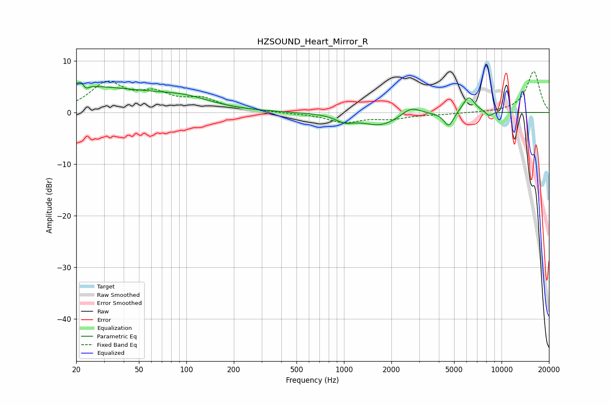

# HZSOUND_Heart_Mirror_R
See [usage instructions](https://github.com/jaakkopasanen/AutoEq#usage) for more options and info.

### Parametric EQs
Apply preamp of -5.9 dB when using parametric equalizer.

|   # | Type    |   Fc (Hz) |    Q |   Gain (dB) |
|-----|---------|-----------|------|-------------|
|   1 | Peaking |        20 | 0.27 |         4.9 |
|   2 | Peaking |        22 | 5.26 |         3.7 |
|   3 | Peaking |        23 | 6    |        -3.5 |
|   4 | Peaking |        99 | 0.81 |         1.6 |
|   5 | Peaking |      1011 | 2.46 |        -1.2 |
|   6 | Peaking |      1711 | 1.17 |        -2.5 |
|   7 | Peaking |      2653 | 2.29 |         1.8 |
|   8 | Peaking |      4625 | 4.49 |        -2.8 |
|   9 | Peaking |      6189 | 3.5  |         3.2 |
|  10 | Peaking |      8335 | 5.97 |        -0.9 |

### Fixed Band EQs
When using fixed band (also called graphic) equalizer, apply preamp of **-8.0 dB** (if available) and set gains manually with these parameters.

|   # | Type    |   Fc (Hz) |    Q |   Gain (dB) |
|-----|---------|-----------|------|-------------|
|   1 | Peaking |        31 | 1.41 |         5.4 |
|   2 | Peaking |        62 | 1.41 |         3.1 |
|   3 | Peaking |       125 | 1.41 |         2.3 |
|   4 | Peaking |       250 | 1.41 |         0.3 |
|   5 | Peaking |       500 | 1.41 |        -0.1 |
|   6 | Peaking |      1000 | 1.41 |        -1.8 |
|   7 | Peaking |      2000 | 1.41 |        -1   |
|   8 | Peaking |      4000 | 1.41 |        -0.3 |
|   9 | Peaking |      8000 | 1.41 |        -0   |
|  10 | Peaking |     16000 | 1.41 |         8   |

### Graphs

