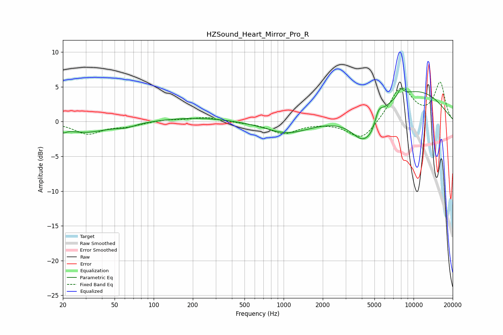

# HZSound_Heart_Mirror_Pro_R
See [usage instructions](https://github.com/jaakkopasanen/AutoEq#usage) for more options and info.

### Parametric EQs
Apply preamp of -4.8 dB when using parametric equalizer.

|   # | Type    |   Fc (Hz) |    Q |   Gain (dB) |
|-----|---------|-----------|------|-------------|
|   1 | Peaking |        20 | 5.76 |        -0.6 |
|   2 | Peaking |        29 | 0.81 |        -1.5 |
|   3 | Peaking |        61 | 1.9  |        -0.5 |
|   4 | Peaking |       214 | 0.54 |         0.6 |
|   5 | Peaking |      1066 | 0.86 |        -1.7 |
|   6 | Peaking |      4143 | 1.48 |        -4.3 |
|   7 | Peaking |      4815 | 3.47 |        -0.9 |
|   8 | Peaking |      5379 | 4.63 |         1.6 |
|   9 | Peaking |      7964 | 5.89 |         1.1 |
|  10 | Peaking |      9960 | 0.42 |         4.5 |

### Fixed Band EQs
When using fixed band (also called graphic) equalizer, apply preamp of **-5.8 dB** (if available) and set gains manually with these parameters.

|   # | Type    |   Fc (Hz) |    Q |   Gain (dB) |
|-----|---------|-----------|------|-------------|
|   1 | Peaking |        31 | 1.41 |        -1.7 |
|   2 | Peaking |        62 | 1.41 |        -0.6 |
|   3 | Peaking |       125 | 1.41 |         0.3 |
|   4 | Peaking |       250 | 1.41 |         0.6 |
|   5 | Peaking |       500 | 1.41 |        -0.1 |
|   6 | Peaking |      1000 | 1.41 |        -1.7 |
|   7 | Peaking |      2000 | 1.41 |        -0   |
|   8 | Peaking |      4000 | 1.41 |        -2.8 |
|   9 | Peaking |      8000 | 1.41 |         4.9 |
|  10 | Peaking |     16000 | 1.41 |         5.5 |

### Graphs

