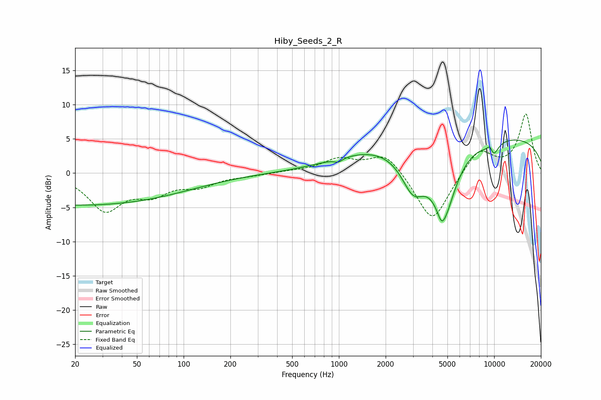

# Hiby_Seeds_2_R
See [usage instructions](https://github.com/jaakkopasanen/AutoEq#usage) for more options and info.

### Parametric EQs
Apply preamp of -4.9 dB when using parametric equalizer.

|   # | Type    |   Fc (Hz) |    Q |   Gain (dB) |
|-----|---------|-----------|------|-------------|
|   1 | Peaking |        21 | 0.18 |        -4.7 |
|   2 | Peaking |       991 | 5.29 |        -0.5 |
|   3 | Peaking |      1503 | 0.55 |         2   |
|   4 | Peaking |      3018 | 1.79 |        -5.7 |
|   5 | Peaking |      3225 | 3.52 |         0.1 |
|   6 | Peaking |      4589 | 5.97 |        -1.4 |
|   7 | Peaking |      4779 | 1.74 |        -9.6 |
|   8 | Peaking |      9437 | 5.88 |         1.9 |
|   9 | Peaking |      9658 | 0.18 |         5.5 |
|  10 | Peaking |      9740 | 3.7  |        -2.8 |

### Fixed Band EQs
When using fixed band (also called graphic) equalizer, apply preamp of **-8.7 dB** (if available) and set gains manually with these parameters.

|   # | Type    |   Fc (Hz) |    Q |   Gain (dB) |
|-----|---------|-----------|------|-------------|
|   1 | Peaking |        31 | 1.41 |        -5.2 |
|   2 | Peaking |        62 | 1.41 |        -2.6 |
|   3 | Peaking |       125 | 1.41 |        -1.7 |
|   4 | Peaking |       250 | 1.41 |        -0.3 |
|   5 | Peaking |       500 | 1.41 |         0.2 |
|   6 | Peaking |      1000 | 1.41 |         1.9 |
|   7 | Peaking |      2000 | 1.41 |         3.1 |
|   8 | Peaking |      4000 | 1.41 |        -7.4 |
|   9 | Peaking |      8000 | 1.41 |         3.6 |
|  10 | Peaking |     16000 | 1.41 |         8.6 |

### Graphs

