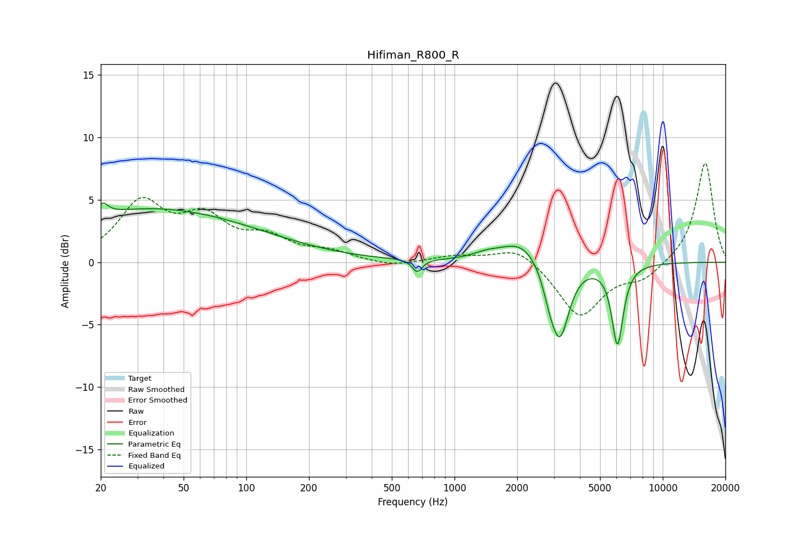

# Hifiman_R800_R
See [usage instructions](https://github.com/jaakkopasanen/AutoEq#usage) for more options and info.

### Parametric EQs
Apply preamp of -4.8 dB when using parametric equalizer.

|   # | Type    |   Fc (Hz) |    Q |   Gain (dB) |
|-----|---------|-----------|------|-------------|
|   1 | Peaking |        20 | 5.96 |        -1.9 |
|   2 | Peaking |        20 | 5.86 |         2.8 |
|   3 | Peaking |        32 | 0.41 |         0.8 |
|   4 | Peaking |        38 | 0.26 |         3.5 |
|   5 | Peaking |       662 | 6    |        -1   |
|   6 | Peaking |      1410 | 2.39 |         0.4 |
|   7 | Peaking |      2110 | 1.35 |         1.9 |
|   8 | Peaking |      2868 | 4.06 |        -1.5 |
|   9 | Peaking |      3213 | 3.14 |        -5.8 |
|  10 | Peaking |      6065 | 5.02 |        -6.4 |

### Fixed Band EQs
When using fixed band (also called graphic) equalizer, apply preamp of **-8.0 dB** (if available) and set gains manually with these parameters.

|   # | Type    |   Fc (Hz) |    Q |   Gain (dB) |
|-----|---------|-----------|------|-------------|
|   1 | Peaking |        31 | 1.41 |         4.5 |
|   2 | Peaking |        62 | 1.41 |         3.1 |
|   3 | Peaking |       125 | 1.41 |         1.7 |
|   4 | Peaking |       250 | 1.41 |         0.7 |
|   5 | Peaking |       500 | 1.41 |        -0.4 |
|   6 | Peaking |      1000 | 1.41 |         0.5 |
|   7 | Peaking |      2000 | 1.41 |         1.3 |
|   8 | Peaking |      4000 | 1.41 |        -4.4 |
|   9 | Peaking |      8000 | 1.41 |        -1.2 |
|  10 | Peaking |     16000 | 1.41 |         8.1 |

### Graphs

