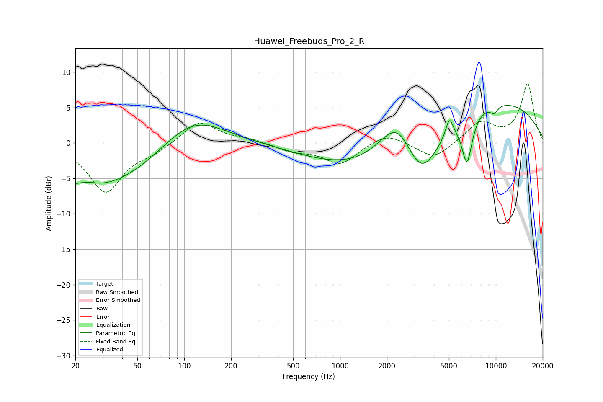

# Huawei_Freebuds_Pro_2_R
See [usage instructions](https://github.com/jaakkopasanen/AutoEq#usage) for more options and info.

### Parametric EQs
Apply preamp of -5.4 dB when using parametric equalizer.

|   # | Type    |   Fc (Hz) |    Q |   Gain (dB) |
|-----|---------|-----------|------|-------------|
|   1 | Peaking |        24 | 2.63 |         0.6 |
|   2 | Peaking |        27 | 0.34 |        -6.7 |
|   3 | Peaking |       111 | 0.68 |         5   |
|   4 | Peaking |      1432 | 0.4  |        -3.9 |
|   5 | Peaking |      2343 | 1.22 |         6.4 |
|   6 | Peaking |      3314 | 1.21 |        -7.7 |
|   7 | Peaking |      5036 | 5.98 |         2.6 |
|   8 | Peaking |      6536 | 4.05 |        -6.7 |
|   9 | Peaking |      9054 | 0.28 |         6.2 |
|  10 | Peaking |      9747 | 5    |        -1   |

### Fixed Band EQs
When using fixed band (also called graphic) equalizer, apply preamp of **-8.4 dB** (if available) and set gains manually with these parameters.

|   # | Type    |   Fc (Hz) |    Q |   Gain (dB) |
|-----|---------|-----------|------|-------------|
|   1 | Peaking |        31 | 1.41 |        -6.9 |
|   2 | Peaking |        62 | 1.41 |        -1.1 |
|   3 | Peaking |       125 | 1.41 |         3.2 |
|   4 | Peaking |       250 | 1.41 |         0.5 |
|   5 | Peaking |       500 | 1.41 |        -1.1 |
|   6 | Peaking |      1000 | 1.41 |        -3   |
|   7 | Peaking |      2000 | 1.41 |         1.5 |
|   8 | Peaking |      4000 | 1.41 |        -2.4 |
|   9 | Peaking |      8000 | 1.41 |         2.9 |
|  10 | Peaking |     16000 | 1.41 |         8.3 |

### Graphs

