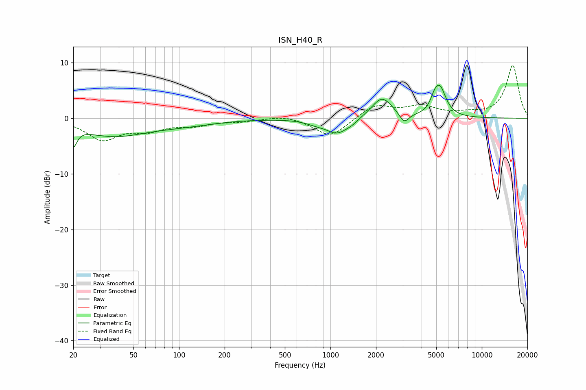

# ISN_H40_R
See [usage instructions](https://github.com/jaakkopasanen/AutoEq#usage) for more options and info.

### Parametric EQs
Apply preamp of -6.0 dB when using parametric equalizer.

|   # | Type    |   Fc (Hz) |    Q |   Gain (dB) |
|-----|---------|-----------|------|-------------|
|   1 | Peaking |        20 | 5.98 |        -3.3 |
|   2 | Peaking |        37 | 0.64 |        -3   |
|   3 | Peaking |       108 | 0.65 |        -0.9 |
|   4 | Peaking |       797 | 2.09 |        -0.6 |
|   5 | Peaking |      1110 | 1.92 |        -2.7 |
|   6 | Peaking |      1391 | 3.8  |        -0.5 |
|   7 | Peaking |      2189 | 2.08 |         3.8 |
|   8 | Peaking |      3069 | 4.6  |        -1.9 |
|   9 | Peaking |      4846 | 5.94 |         1.3 |
|  10 | Peaking |      5278 | 3.48 |         5.2 |

### Fixed Band EQs
When using fixed band (also called graphic) equalizer, apply preamp of **-9.6 dB** (if available) and set gains manually with these parameters.

|   # | Type    |   Fc (Hz) |    Q |   Gain (dB) |
|-----|---------|-----------|------|-------------|
|   1 | Peaking |        31 | 1.41 |        -3.7 |
|   2 | Peaking |        62 | 1.41 |        -1.8 |
|   3 | Peaking |       125 | 1.41 |        -1.1 |
|   4 | Peaking |       250 | 1.41 |        -0.5 |
|   5 | Peaking |       500 | 1.41 |         0.6 |
|   6 | Peaking |      1000 | 1.41 |        -3.4 |
|   7 | Peaking |      2000 | 1.41 |         2.4 |
|   8 | Peaking |      4000 | 1.41 |         1.9 |
|   9 | Peaking |      8000 | 1.41 |         0.6 |
|  10 | Peaking |     16000 | 1.41 |         9.5 |

### Graphs

