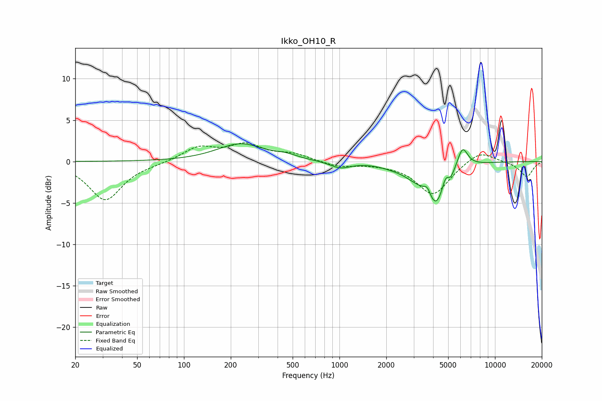

# Ikko_OH10_R
See [usage instructions](https://github.com/jaakkopasanen/AutoEq#usage) for more options and info.

### Parametric EQs
Apply preamp of -2.2 dB when using parametric equalizer.

|   # | Type    |   Fc (Hz) |    Q |   Gain (dB) |
|-----|---------|-----------|------|-------------|
|   1 | Peaking |       231 | 0.94 |         2.1 |
|   2 | Peaking |       455 | 2.1  |         0.4 |
|   3 | Peaking |      1010 | 2.16 |        -0.8 |
|   4 | Peaking |      2136 | 1.97 |        -0.2 |
|   5 | Peaking |      3061 | 1.61 |        -1.2 |
|   6 | Peaking |      3679 | 6    |         1.2 |
|   7 | Peaking |      4174 | 2.2  |        -5   |
|   8 | Peaking |      4809 | 6    |         1.5 |
|   9 | Peaking |      5175 | 6    |        -0.7 |
|  10 | Peaking |      6181 | 4.04 |         2.6 |

### Fixed Band EQs
When using fixed band (also called graphic) equalizer, apply preamp of **-2.4 dB** (if available) and set gains manually with these parameters.

|   # | Type    |   Fc (Hz) |    Q |   Gain (dB) |
|-----|---------|-----------|------|-------------|
|   1 | Peaking |        31 | 1.41 |        -4.6 |
|   2 | Peaking |        62 | 1.41 |        -0.2 |
|   3 | Peaking |       125 | 1.41 |         1.7 |
|   4 | Peaking |       250 | 1.41 |         1.9 |
|   5 | Peaking |       500 | 1.41 |         0.8 |
|   6 | Peaking |      1000 | 1.41 |        -0.6 |
|   7 | Peaking |      2000 | 1.41 |        -0.2 |
|   8 | Peaking |      4000 | 1.41 |        -4   |
|   9 | Peaking |      8000 | 1.41 |         1.4 |
|  10 | Peaking |     16000 | 1.41 |        -1.8 |

### Graphs

