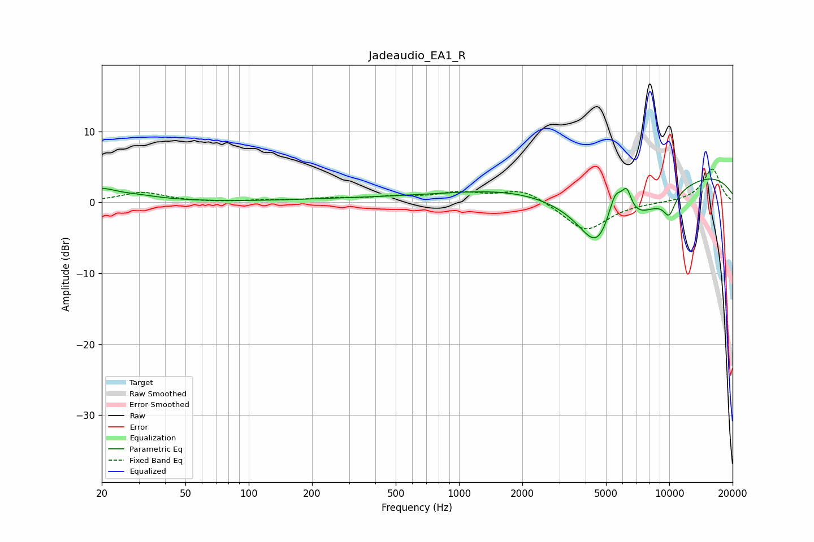

# Jadeaudio_EA1_R
See [usage instructions](https://github.com/jaakkopasanen/AutoEq#usage) for more options and info.

### Parametric EQs
Apply preamp of -3.4 dB when using parametric equalizer.

|   # | Type    |   Fc (Hz) |    Q |   Gain (dB) |
|-----|---------|-----------|------|-------------|
|   1 | Peaking |        21 | 1.1  |         2.3 |
|   2 | Peaking |        24 | 2.34 |        -0.6 |
|   3 | Peaking |       422 | 0.36 |         0.5 |
|   4 | Peaking |      1680 | 0.46 |         0.4 |
|   5 | Peaking |      4505 | 1.9  |        -4.3 |
|   6 | Peaking |      5535 | 3.68 |         5.1 |
|   7 | Peaking |      5577 | 0.53 |        -8.6 |
|   8 | Peaking |      6278 | 5.72 |         3.3 |
|   9 | Peaking |      7911 | 0.18 |         6.1 |
|  10 | Peaking |     10000 | 4.26 |        -2.7 |

### Fixed Band EQs
When using fixed band (also called graphic) equalizer, apply preamp of **-4.8 dB** (if available) and set gains manually with these parameters.

|   # | Type    |   Fc (Hz) |    Q |   Gain (dB) |
|-----|---------|-----------|------|-------------|
|   1 | Peaking |        31 | 1.41 |         1.4 |
|   2 | Peaking |        62 | 1.41 |        -0   |
|   3 | Peaking |       125 | 1.41 |         0.2 |
|   4 | Peaking |       250 | 1.41 |         0.5 |
|   5 | Peaking |       500 | 1.41 |         0.7 |
|   6 | Peaking |      1000 | 1.41 |         1.2 |
|   7 | Peaking |      2000 | 1.41 |         1.9 |
|   8 | Peaking |      4000 | 1.41 |        -4.1 |
|   9 | Peaking |      8000 | 1.41 |        -0   |
|  10 | Peaking |     16000 | 1.41 |         4.8 |

### Graphs

