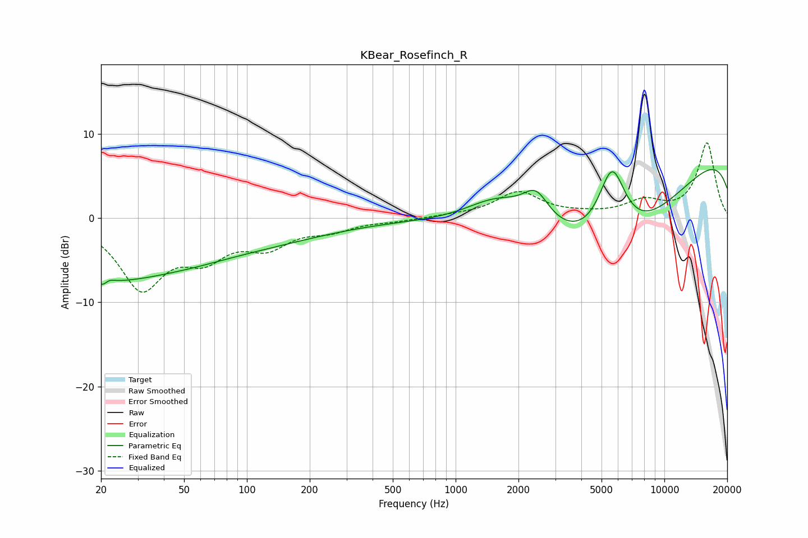

# KBear_Rosefinch_R
See [usage instructions](https://github.com/jaakkopasanen/AutoEq#usage) for more options and info.

### Parametric EQs
Apply preamp of -5.9 dB when using parametric equalizer.

|   # | Type    |   Fc (Hz) |    Q |   Gain (dB) |
|-----|---------|-----------|------|-------------|
|   1 | Peaking |        20 | 0.42 |        -6.4 |
|   2 | Peaking |        21 | 4.6  |        -1.3 |
|   3 | Peaking |        22 | 5.39 |         1   |
|   4 | Peaking |        55 | 0.81 |        -0.4 |
|   5 | Peaking |        94 | 0.37 |        -2.8 |
|   6 | Peaking |      1595 | 0.91 |         3.5 |
|   7 | Peaking |      2427 | 2.25 |         3.4 |
|   8 | Peaking |      5613 | 1.81 |        10.7 |
|   9 | Peaking |      5644 | 0.38 |       -16.3 |
|  10 | Peaking |     10000 | 0.18 |        11.6 |

### Fixed Band EQs
When using fixed band (also called graphic) equalizer, apply preamp of **-9.0 dB** (if available) and set gains manually with these parameters.

|   # | Type    |   Fc (Hz) |    Q |   Gain (dB) |
|-----|---------|-----------|------|-------------|
|   1 | Peaking |        31 | 1.41 |        -8   |
|   2 | Peaking |        62 | 1.41 |        -3.8 |
|   3 | Peaking |       125 | 1.41 |        -2.9 |
|   4 | Peaking |       250 | 1.41 |        -1.2 |
|   5 | Peaking |       500 | 1.41 |        -0.3 |
|   6 | Peaking |      1000 | 1.41 |         0.2 |
|   7 | Peaking |      2000 | 1.41 |         3   |
|   8 | Peaking |      4000 | 1.41 |         0.3 |
|   9 | Peaking |      8000 | 1.41 |         1.8 |
|  10 | Peaking |     16000 | 1.41 |         8.9 |

### Graphs

