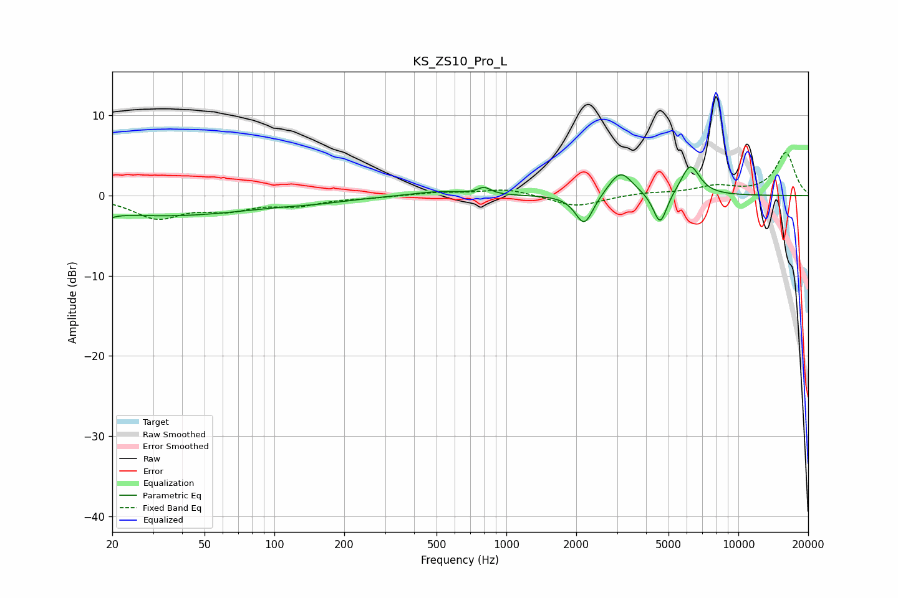

# KS_ZS10_Pro_L
See [usage instructions](https://github.com/jaakkopasanen/AutoEq#usage) for more options and info.

### Parametric EQs
Apply preamp of -3.7 dB when using parametric equalizer.

|   # | Type    |   Fc (Hz) |    Q |   Gain (dB) |
|-----|---------|-----------|------|-------------|
|   1 | Peaking |        20 | 5.65 |        -2.5 |
|   2 | Peaking |        20 | 6    |         2   |
|   3 | Peaking |        33 | 0.34 |        -2.5 |
|   4 | Peaking |       155 | 1.02 |        -0.4 |
|   5 | Peaking |       509 | 1.23 |         0.6 |
|   6 | Peaking |       802 | 4.96 |         0.8 |
|   7 | Peaking |      2168 | 3.68 |        -3.9 |
|   8 | Peaking |      3107 | 2.73 |         3.2 |
|   9 | Peaking |      4599 | 4.71 |        -4.1 |
|  10 | Peaking |      6207 | 3.36 |         3.8 |

### Fixed Band EQs
When using fixed band (also called graphic) equalizer, apply preamp of **-5.5 dB** (if available) and set gains manually with these parameters.

|   # | Type    |   Fc (Hz) |    Q |   Gain (dB) |
|-----|---------|-----------|------|-------------|
|   1 | Peaking |        31 | 1.41 |        -2.7 |
|   2 | Peaking |        62 | 1.41 |        -1.5 |
|   3 | Peaking |       125 | 1.41 |        -1.1 |
|   4 | Peaking |       250 | 1.41 |        -0.2 |
|   5 | Peaking |       500 | 1.41 |         0.4 |
|   6 | Peaking |      1000 | 1.41 |         0.9 |
|   7 | Peaking |      2000 | 1.41 |        -1.4 |
|   8 | Peaking |      4000 | 1.41 |         0.3 |
|   9 | Peaking |      8000 | 1.41 |         1.1 |
|  10 | Peaking |     16000 | 1.41 |         5.3 |

### Graphs

