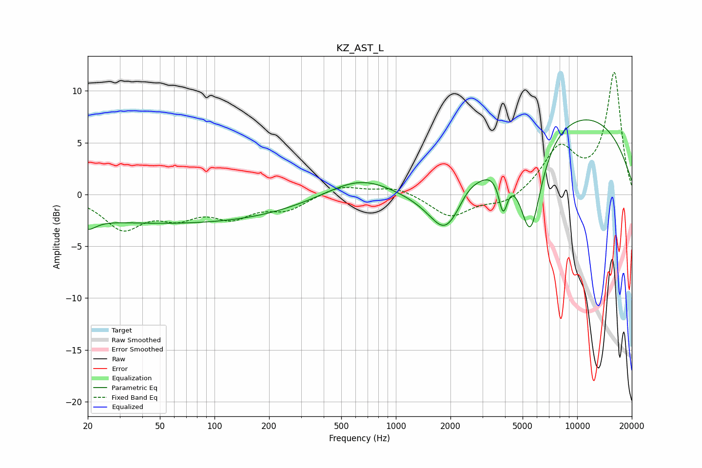

# KZ_AST_L
See [usage instructions](https://github.com/jaakkopasanen/AutoEq#usage) for more options and info.

### Parametric EQs
Apply preamp of -7.3 dB when using parametric equalizer.

|   # | Type    |   Fc (Hz) |    Q |   Gain (dB) |
|-----|---------|-----------|------|-------------|
|   1 | Peaking |        20 | 3.14 |        -1.1 |
|   2 | Peaking |        58 | 0.18 |        -2.8 |
|   3 | Peaking |       636 | 0.77 |         2   |
|   4 | Peaking |      1732 | 0.67 |        -1.6 |
|   5 | Peaking |      1892 | 1.58 |        -4.2 |
|   6 | Peaking |      2481 | 2.69 |         0.6 |
|   7 | Peaking |      3884 | 5.99 |        -1.8 |
|   8 | Peaking |      3922 | 5.62 |        -1.8 |
|   9 | Peaking |      5517 | 2.17 |        -9.6 |
|  10 | Peaking |      9146 | 0.27 |         8   |

### Fixed Band EQs
When using fixed band (also called graphic) equalizer, apply preamp of **-11.9 dB** (if available) and set gains manually with these parameters.

|   # | Type    |   Fc (Hz) |    Q |   Gain (dB) |
|-----|---------|-----------|------|-------------|
|   1 | Peaking |        31 | 1.41 |        -3.1 |
|   2 | Peaking |        62 | 1.41 |        -1.8 |
|   3 | Peaking |       125 | 1.41 |        -1.9 |
|   4 | Peaking |       250 | 1.41 |        -1.3 |
|   5 | Peaking |       500 | 1.41 |         0.9 |
|   6 | Peaking |      1000 | 1.41 |         0.8 |
|   7 | Peaking |      2000 | 1.41 |        -2.2 |
|   8 | Peaking |      4000 | 1.41 |        -1   |
|   9 | Peaking |      8000 | 1.41 |         4.3 |
|  10 | Peaking |     16000 | 1.41 |        11.7 |

### Graphs

