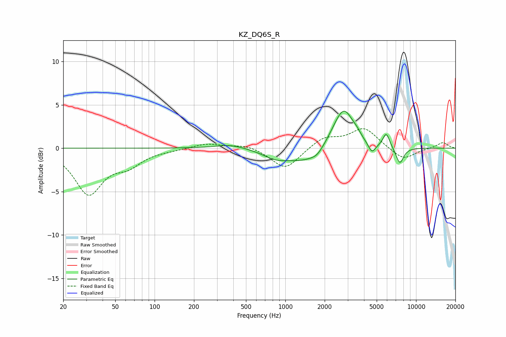

# KZ_DQ6S_R
See [usage instructions](https://github.com/jaakkopasanen/AutoEq#usage) for more options and info.

### Parametric EQs
Apply preamp of -4.4 dB when using parametric equalizer.

|   # | Type    |   Fc (Hz) |    Q |   Gain (dB) |
|-----|---------|-----------|------|-------------|
|   1 | Peaking |       383 | 1.18 |         0.5 |
|   2 | Peaking |       835 | 1.56 |        -0.7 |
|   3 | Peaking |      1515 | 0.81 |        -1.8 |
|   4 | Peaking |      1745 | 3.52 |        -0.4 |
|   5 | Peaking |      2393 | 1.63 |         1.3 |
|   6 | Peaking |      2830 | 1.97 |         4.1 |
|   7 | Peaking |      3515 | 4.37 |         0.4 |
|   8 | Peaking |      4594 | 5.05 |        -1.1 |
|   9 | Peaking |      5920 | 5.18 |         1.7 |
|  10 | Peaking |      7509 | 4.48 |        -1.9 |

### Fixed Band EQs
When using fixed band (also called graphic) equalizer, apply preamp of **-2.3 dB** (if available) and set gains manually with these parameters.

|   # | Type    |   Fc (Hz) |    Q |   Gain (dB) |
|-----|---------|-----------|------|-------------|
|   1 | Peaking |        31 | 1.41 |        -5.1 |
|   2 | Peaking |        62 | 1.41 |        -1.6 |
|   3 | Peaking |       125 | 1.41 |        -0.1 |
|   4 | Peaking |       250 | 1.41 |         0.6 |
|   5 | Peaking |       500 | 1.41 |         0.5 |
|   6 | Peaking |      1000 | 1.41 |        -2.5 |
|   7 | Peaking |      2000 | 1.41 |         1.3 |
|   8 | Peaking |      4000 | 1.41 |         2.3 |
|   9 | Peaking |      8000 | 1.41 |        -1.4 |
|  10 | Peaking |     16000 | 1.41 |         0.7 |

### Graphs

