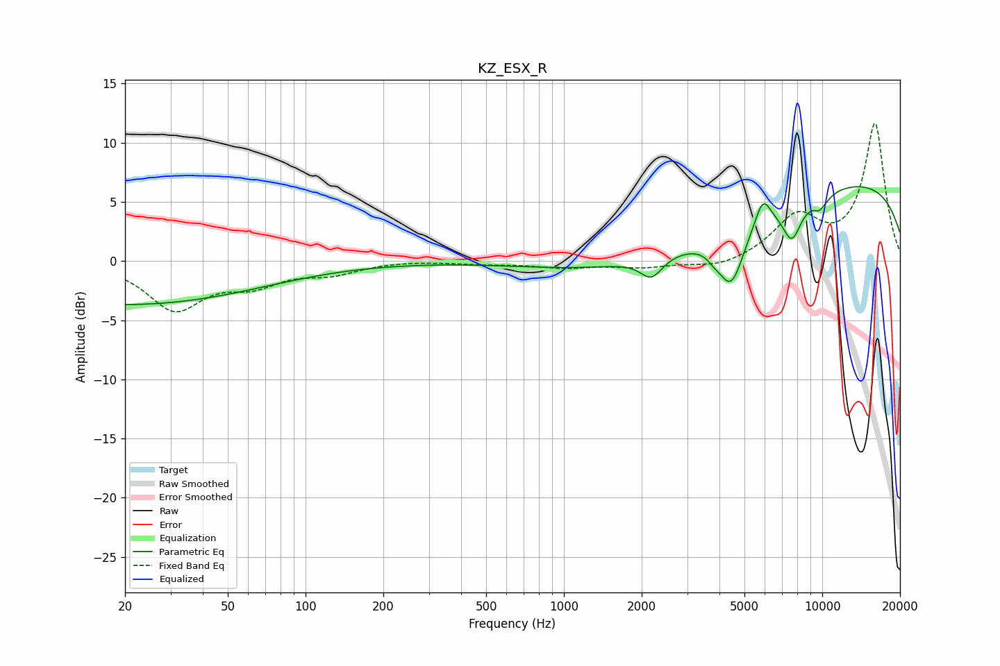

# KZ_ESX_R
See [usage instructions](https://github.com/jaakkopasanen/AutoEq#usage) for more options and info.

### Parametric EQs
Apply preamp of -6.4 dB when using parametric equalizer.

|   # | Type    |   Fc (Hz) |    Q |   Gain (dB) |
|-----|---------|-----------|------|-------------|
|   1 | Peaking |        20 | 0.26 |        -3.7 |
|   2 | Peaking |      2182 | 3.33 |        -1.7 |
|   3 | Peaking |      3115 | 0.33 |        -3.3 |
|   4 | Peaking |      3807 | 5.88 |        -0.5 |
|   5 | Peaking |      4439 | 2.81 |        -4.8 |
|   6 | Peaking |      5889 | 4.51 |         2.3 |
|   7 | Peaking |      7632 | 3.66 |        -3   |
|   8 | Peaking |      9909 | 0.19 |         7.4 |
|   9 | Peaking |      9949 | 5.01 |        -2.9 |
|  10 | Peaking |     10000 | 5.89 |         1.9 |

### Fixed Band EQs
When using fixed band (also called graphic) equalizer, apply preamp of **-11.7 dB** (if available) and set gains manually with these parameters.

|   # | Type    |   Fc (Hz) |    Q |   Gain (dB) |
|-----|---------|-----------|------|-------------|
|   1 | Peaking |        31 | 1.41 |        -3.9 |
|   2 | Peaking |        62 | 1.41 |        -1.7 |
|   3 | Peaking |       125 | 1.41 |        -0.9 |
|   4 | Peaking |       250 | 1.41 |         0.1 |
|   5 | Peaking |       500 | 1.41 |        -0.2 |
|   6 | Peaking |      1000 | 1.41 |        -0.5 |
|   7 | Peaking |      2000 | 1.41 |        -0.5 |
|   8 | Peaking |      4000 | 1.41 |        -0.7 |
|   9 | Peaking |      8000 | 1.41 |         3.6 |
|  10 | Peaking |     16000 | 1.41 |        11.5 |

### Graphs

