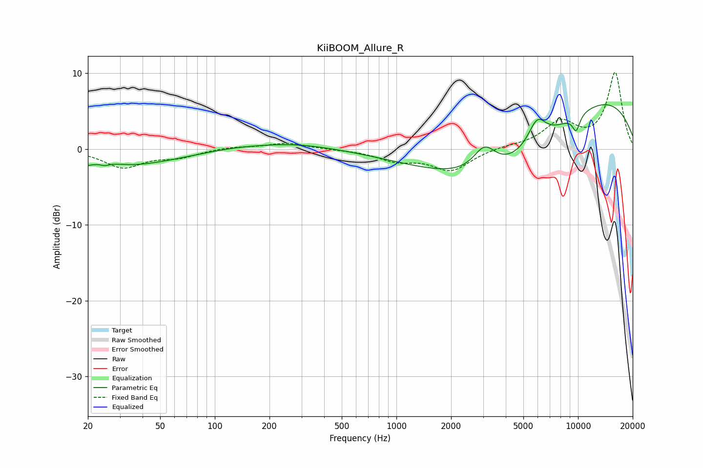

# KiiBOOM_Allure_R
See [usage instructions](https://github.com/jaakkopasanen/AutoEq#usage) for more options and info.

### Parametric EQs
Apply preamp of -6.0 dB when using parametric equalizer.

|   # | Type    |   Fc (Hz) |    Q |   Gain (dB) |
|-----|---------|-----------|------|-------------|
|   1 | Peaking |        21 | 0.35 |        -2.9 |
|   2 | Peaking |        24 | 1.63 |         1   |
|   3 | Peaking |        25 | 5.75 |        -0.4 |
|   4 | Peaking |       120 | 0.89 |         0.2 |
|   5 | Peaking |       262 | 0.58 |         0.9 |
|   6 | Peaking |      3059 | 2.28 |         3.3 |
|   7 | Peaking |      4003 | 0.37 |        -9.5 |
|   8 | Peaking |      5953 | 2.72 |         3.4 |
|   9 | Peaking |      9209 | 0.24 |         9.4 |
|  10 | Peaking |      9769 | 5.86 |        -2.1 |

### Fixed Band EQs
When using fixed band (also called graphic) equalizer, apply preamp of **-10.2 dB** (if available) and set gains manually with these parameters.

|   # | Type    |   Fc (Hz) |    Q |   Gain (dB) |
|-----|---------|-----------|------|-------------|
|   1 | Peaking |        31 | 1.41 |        -2.3 |
|   2 | Peaking |        62 | 1.41 |        -1   |
|   3 | Peaking |       125 | 1.41 |         0.3 |
|   4 | Peaking |       250 | 1.41 |         0.8 |
|   5 | Peaking |       500 | 1.41 |        -0   |
|   6 | Peaking |      1000 | 1.41 |        -1.4 |
|   7 | Peaking |      2000 | 1.41 |        -2.8 |
|   8 | Peaking |      4000 | 1.41 |         0.3 |
|   9 | Peaking |      8000 | 1.41 |         3.4 |
|  10 | Peaking |     16000 | 1.41 |        10   |

### Graphs

