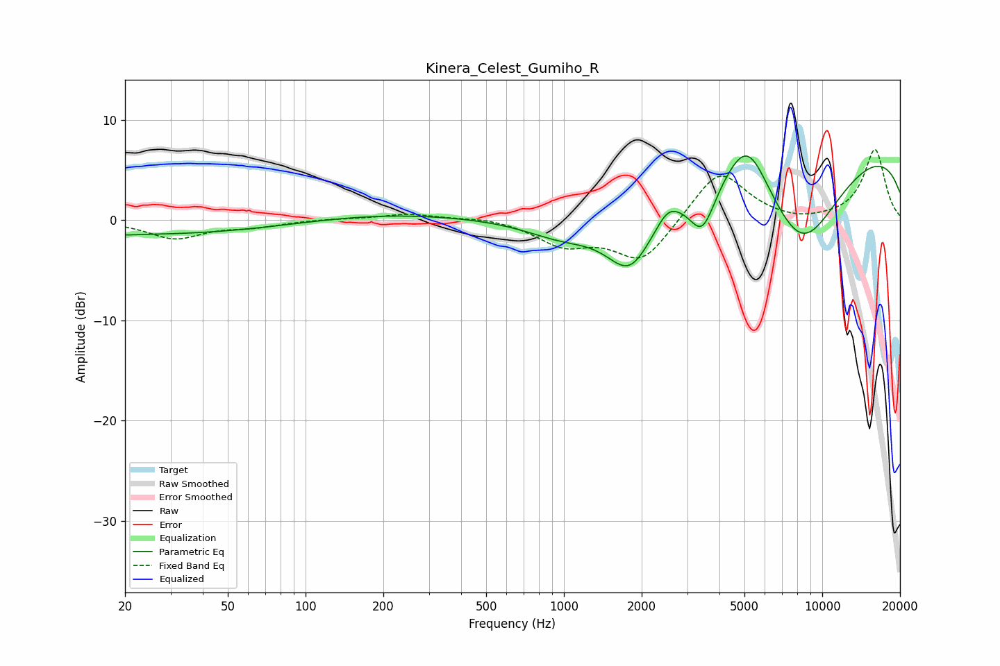

# Kinera_Celest_Gumiho_R
See [usage instructions](https://github.com/jaakkopasanen/AutoEq#usage) for more options and info.

### Parametric EQs
Apply preamp of -6.5 dB when using parametric equalizer.

|   # | Type    |   Fc (Hz) |    Q |   Gain (dB) |
|-----|---------|-----------|------|-------------|
|   1 | Peaking |        20 | 3.65 |        -0.1 |
|   2 | Peaking |        25 | 0.26 |        -1.4 |
|   3 | Peaking |       197 | 0.44 |         0.7 |
|   4 | Peaking |       999 | 0.93 |        -2.2 |
|   5 | Peaking |      1808 | 1.46 |        -6.6 |
|   6 | Peaking |      2528 | 3.37 |         1.2 |
|   7 | Peaking |      3436 | 2.75 |        -4.7 |
|   8 | Peaking |      5137 | 1.64 |         5.7 |
|   9 | Peaking |      8297 | 0.77 |       -10.8 |
|  10 | Peaking |      9880 | 0.18 |         8.6 |

### Fixed Band EQs
When using fixed band (also called graphic) equalizer, apply preamp of **-7.1 dB** (if available) and set gains manually with these parameters.

|   # | Type    |   Fc (Hz) |    Q |   Gain (dB) |
|-----|---------|-----------|------|-------------|
|   1 | Peaking |        31 | 1.41 |        -1.8 |
|   2 | Peaking |        62 | 1.41 |        -0.6 |
|   3 | Peaking |       125 | 1.41 |         0.1 |
|   4 | Peaking |       250 | 1.41 |         0.6 |
|   5 | Peaking |       500 | 1.41 |         0.3 |
|   6 | Peaking |      1000 | 1.41 |        -2.3 |
|   7 | Peaking |      2000 | 1.41 |        -4.2 |
|   8 | Peaking |      4000 | 1.41 |         5.1 |
|   9 | Peaking |      8000 | 1.41 |        -0.4 |
|  10 | Peaking |     16000 | 1.41 |         7   |

### Graphs

