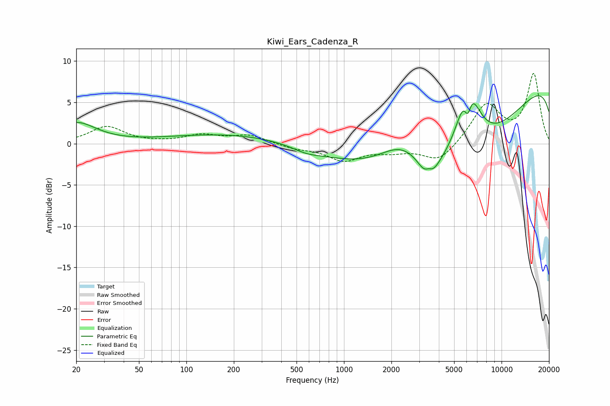

# Kiwi_Ears_Cadenza_R
See [usage instructions](https://github.com/jaakkopasanen/AutoEq#usage) for more options and info.

### Parametric EQs
Apply preamp of -5.9 dB when using parametric equalizer.

|   # | Type    |   Fc (Hz) |    Q |   Gain (dB) |
|-----|---------|-----------|------|-------------|
|   1 | Peaking |        20 | 1.14 |         2.5 |
|   2 | Peaking |       205 | 0.33 |         1.2 |
|   3 | Peaking |       579 | 1.61 |        -0.6 |
|   4 | Peaking |      2345 | 0.96 |         3.6 |
|   5 | Peaking |      3436 | 2.78 |        -3.3 |
|   6 | Peaking |      3445 | 5.32 |         1.3 |
|   7 | Peaking |      5337 | 0.27 |       -16.2 |
|   8 | Peaking |      6105 | 5.99 |        -3.4 |
|   9 | Peaking |      6114 | 1.85 |        10.2 |
|  10 | Peaking |     10000 | 0.18 |        13.6 |

### Fixed Band EQs
When using fixed band (also called graphic) equalizer, apply preamp of **-8.6 dB** (if available) and set gains manually with these parameters.

|   # | Type    |   Fc (Hz) |    Q |   Gain (dB) |
|-----|---------|-----------|------|-------------|
|   1 | Peaking |        31 | 1.41 |         2   |
|   2 | Peaking |        62 | 1.41 |         0   |
|   3 | Peaking |       125 | 1.41 |         1   |
|   4 | Peaking |       250 | 1.41 |         1   |
|   5 | Peaking |       500 | 1.41 |        -0.5 |
|   6 | Peaking |      1000 | 1.41 |        -1.9 |
|   7 | Peaking |      2000 | 1.41 |        -0.8 |
|   8 | Peaking |      4000 | 1.41 |        -2.2 |
|   9 | Peaking |      8000 | 1.41 |         4.7 |
|  10 | Peaking |     16000 | 1.41 |         8.3 |

### Graphs

