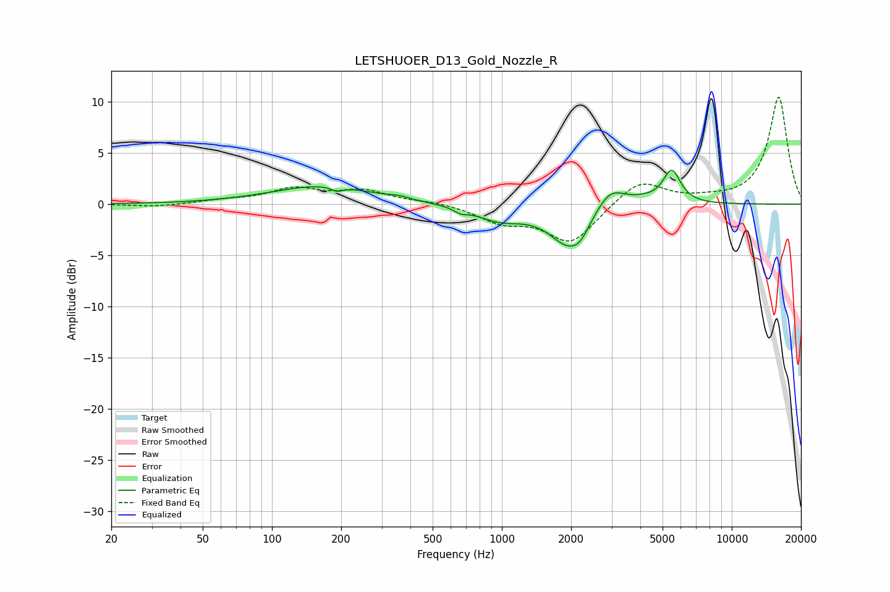

# LETSHUOER_D13_Gold_Nozzle_R
See [usage instructions](https://github.com/jaakkopasanen/AutoEq#usage) for more options and info.

### Parametric EQs
Apply preamp of -3.4 dB when using parametric equalizer.

|   # | Type    |   Fc (Hz) |    Q |   Gain (dB) |
|-----|---------|-----------|------|-------------|
|   1 | Peaking |       166 | 0.64 |         1.8 |
|   2 | Peaking |       192 | 6    |        -0.4 |
|   3 | Peaking |       357 | 3.37 |         0.2 |
|   4 | Peaking |       662 | 5.04 |        -0.4 |
|   5 | Peaking |       977 | 1.36 |        -1.4 |
|   6 | Peaking |      1984 | 1.62 |        -4.1 |
|   7 | Peaking |      2197 | 4.45 |        -0.6 |
|   8 | Peaking |      2954 | 2.12 |         2.3 |
|   9 | Peaking |      4182 | 2.25 |         0.3 |
|  10 | Peaking |      5479 | 3.61 |         3.2 |

### Fixed Band EQs
When using fixed band (also called graphic) equalizer, apply preamp of **-10.5 dB** (if available) and set gains manually with these parameters.

|   # | Type    |   Fc (Hz) |    Q |   Gain (dB) |
|-----|---------|-----------|------|-------------|
|   1 | Peaking |        31 | 1.41 |        -0.3 |
|   2 | Peaking |        62 | 1.41 |         0.3 |
|   3 | Peaking |       125 | 1.41 |         1.4 |
|   4 | Peaking |       250 | 1.41 |         1.2 |
|   5 | Peaking |       500 | 1.41 |         0.3 |
|   6 | Peaking |      1000 | 1.41 |        -1.6 |
|   7 | Peaking |      2000 | 1.41 |        -3.8 |
|   8 | Peaking |      4000 | 1.41 |         2.4 |
|   9 | Peaking |      8000 | 1.41 |         0.3 |
|  10 | Peaking |     16000 | 1.41 |        10.5 |

### Graphs

