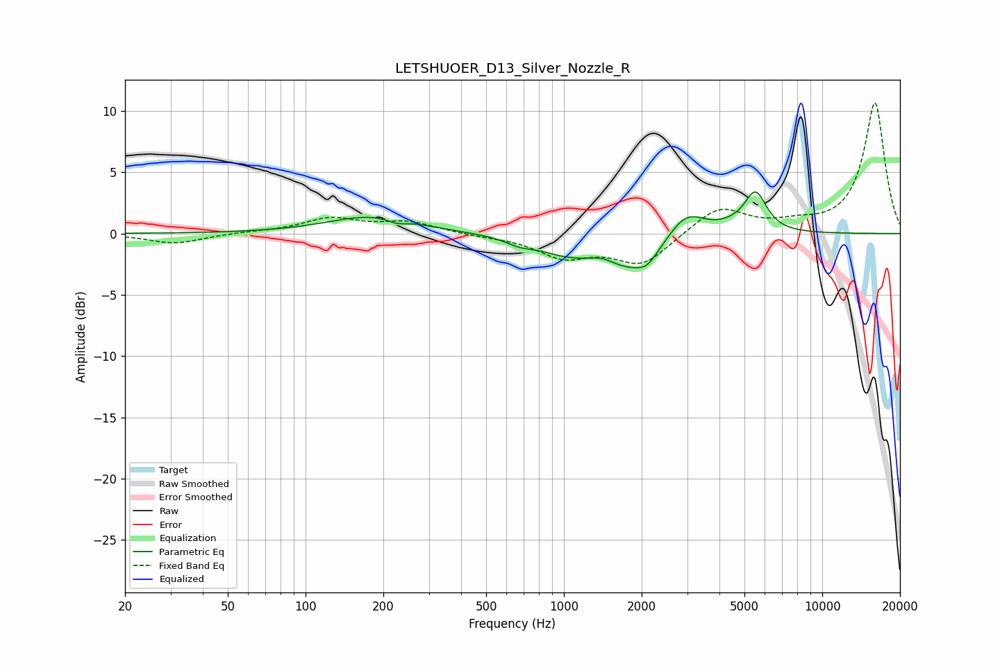

# LETSHUOER_D13_Silver_Nozzle_R
See [usage instructions](https://github.com/jaakkopasanen/AutoEq#usage) for more options and info.

### Parametric EQs
Apply preamp of -3.5 dB when using parametric equalizer.

|   # | Type    |   Fc (Hz) |    Q |   Gain (dB) |
|-----|---------|-----------|------|-------------|
|   1 | Peaking |       181 | 0.82 |         1.4 |
|   2 | Peaking |       226 | 4.02 |        -0.4 |
|   3 | Peaking |       670 | 2.89 |        -0.4 |
|   4 | Peaking |      1008 | 1.22 |        -1.1 |
|   5 | Peaking |      1417 | 2.86 |         0.5 |
|   6 | Peaking |      1858 | 1.07 |        -2.9 |
|   7 | Peaking |      2099 | 3.94 |        -0.7 |
|   8 | Peaking |      2958 | 1.81 |         2.6 |
|   9 | Peaking |      4503 | 2.37 |         0.4 |
|  10 | Peaking |      5518 | 3.21 |         3.2 |

### Fixed Band EQs
When using fixed band (also called graphic) equalizer, apply preamp of **-10.7 dB** (if available) and set gains manually with these parameters.

|   # | Type    |   Fc (Hz) |    Q |   Gain (dB) |
|-----|---------|-----------|------|-------------|
|   1 | Peaking |        31 | 1.41 |        -0.8 |
|   2 | Peaking |        62 | 1.41 |         0.1 |
|   3 | Peaking |       125 | 1.41 |         1.2 |
|   4 | Peaking |       250 | 1.41 |         0.9 |
|   5 | Peaking |       500 | 1.41 |        -0.2 |
|   6 | Peaking |      1000 | 1.41 |        -1.8 |
|   7 | Peaking |      2000 | 1.41 |        -2.5 |
|   8 | Peaking |      4000 | 1.41 |         2.2 |
|   9 | Peaking |      8000 | 1.41 |         0.6 |
|  10 | Peaking |     16000 | 1.41 |        10.7 |

### Graphs

