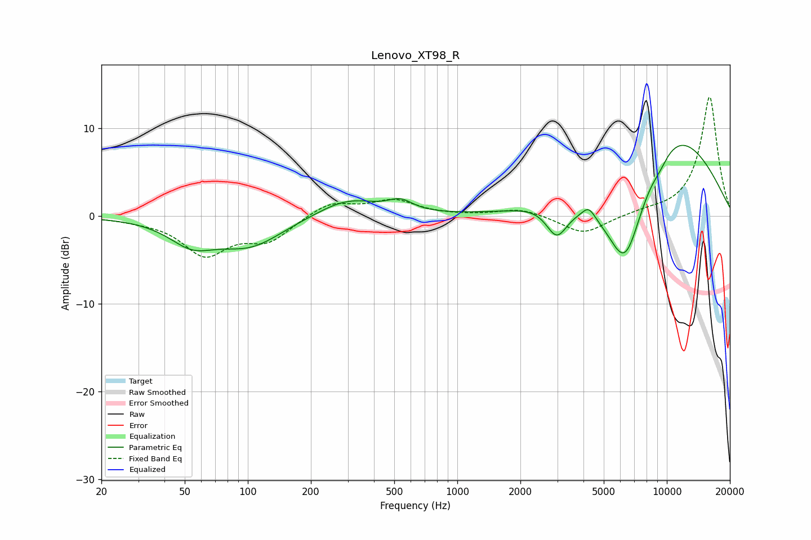

# Lenovo_XT98_R
See [usage instructions](https://github.com/jaakkopasanen/AutoEq#usage) for more options and info.

### Parametric EQs
Apply preamp of -8.2 dB when using parametric equalizer.

|   # | Type    |   Fc (Hz) |    Q |   Gain (dB) |
|-----|---------|-----------|------|-------------|
|   1 | Peaking |        54 | 1.3  |        -2.6 |
|   2 | Peaking |       102 | 0.89 |        -3.2 |
|   3 | Peaking |       299 | 0.97 |         2.1 |
|   4 | Peaking |       536 | 2.44 |         1.2 |
|   5 | Peaking |      2494 | 1.44 |         0.4 |
|   6 | Peaking |      2981 | 2.73 |        -3.6 |
|   7 | Peaking |      4236 | 4.65 |         1.3 |
|   8 | Peaking |      6324 | 1.32 |       -12.2 |
|   9 | Peaking |      9259 | 2.93 |        -1   |
|  10 | Peaking |      9993 | 0.44 |        10.9 |

### Fixed Band EQs
When using fixed band (also called graphic) equalizer, apply preamp of **-13.6 dB** (if available) and set gains manually with these parameters.

|   # | Type    |   Fc (Hz) |    Q |   Gain (dB) |
|-----|---------|-----------|------|-------------|
|   1 | Peaking |        31 | 1.41 |        -0.3 |
|   2 | Peaking |        62 | 1.41 |        -4.2 |
|   3 | Peaking |       125 | 1.41 |        -2.6 |
|   4 | Peaking |       250 | 1.41 |         1.6 |
|   5 | Peaking |       500 | 1.41 |         1.7 |
|   6 | Peaking |      1000 | 1.41 |         0   |
|   7 | Peaking |      2000 | 1.41 |         0.9 |
|   8 | Peaking |      4000 | 1.41 |        -2.1 |
|   9 | Peaking |      8000 | 1.41 |         0.4 |
|  10 | Peaking |     16000 | 1.41 |        13.7 |

### Graphs

