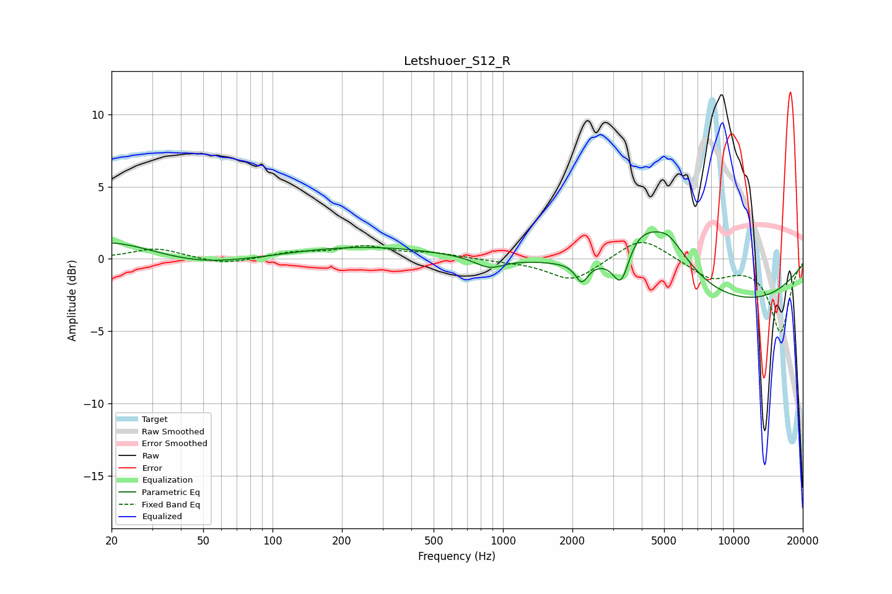

# Letshuoer_S12_R
See [usage instructions](https://github.com/jaakkopasanen/AutoEq#usage) for more options and info.

### Parametric EQs
Apply preamp of -2.0 dB when using parametric equalizer.

|   # | Type    |   Fc (Hz) |    Q |   Gain (dB) |
|-----|---------|-----------|------|-------------|
|   1 | Peaking |        20 | 0.65 |         1.4 |
|   2 | Peaking |        46 | 0.6  |        -0.7 |
|   3 | Peaking |       242 | 0.43 |         0.9 |
|   4 | Peaking |       871 | 2.23 |        -0.8 |
|   5 | Peaking |      2197 | 5.25 |        -1.3 |
|   6 | Peaking |      3255 | 4.18 |        -2.3 |
|   7 | Peaking |      3842 | 2.1  |         1.4 |
|   8 | Peaking |      5012 | 1.23 |         3.5 |
|   9 | Peaking |      5238 | 5.38 |         0.1 |
|  10 | Peaking |      9866 | 0.32 |        -3.1 |

### Fixed Band EQs
When using fixed band (also called graphic) equalizer, apply preamp of **-1.2 dB** (if available) and set gains manually with these parameters.

|   # | Type    |   Fc (Hz) |    Q |   Gain (dB) |
|-----|---------|-----------|------|-------------|
|   1 | Peaking |        31 | 1.41 |         0.7 |
|   2 | Peaking |        62 | 1.41 |        -0.4 |
|   3 | Peaking |       125 | 1.41 |         0.4 |
|   4 | Peaking |       250 | 1.41 |         0.8 |
|   5 | Peaking |       500 | 1.41 |         0.4 |
|   6 | Peaking |      1000 | 1.41 |        -0.1 |
|   7 | Peaking |      2000 | 1.41 |        -1.6 |
|   8 | Peaking |      4000 | 1.41 |         1.6 |
|   9 | Peaking |      8000 | 1.41 |        -1.3 |
|  10 | Peaking |     16000 | 1.41 |        -5   |

### Graphs

