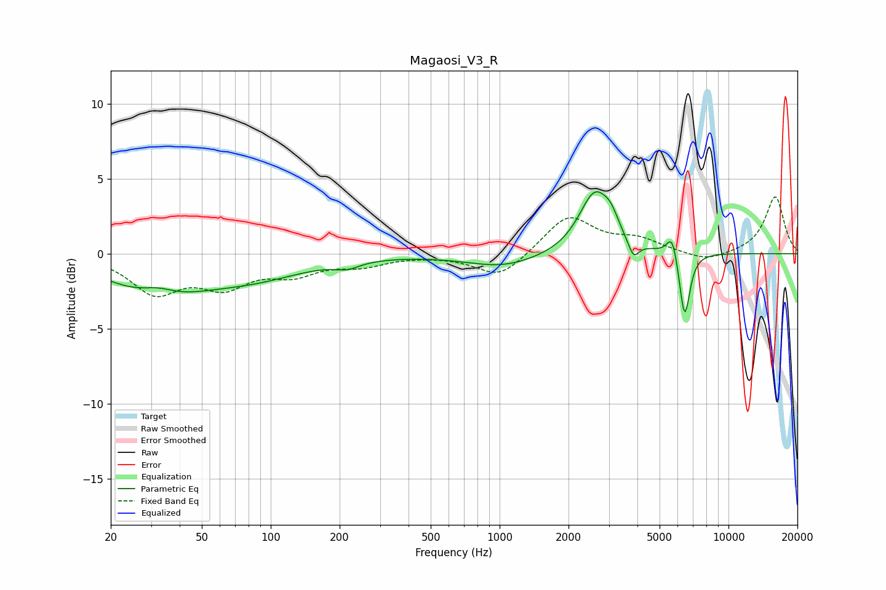

# Magaosi_V3_R
See [usage instructions](https://github.com/jaakkopasanen/AutoEq#usage) for more options and info.

### Parametric EQs
Apply preamp of -4.2 dB when using parametric equalizer.

|   # | Type    |   Fc (Hz) |    Q |   Gain (dB) |
|-----|---------|-----------|------|-------------|
|   1 | Peaking |        31 | 0.68 |        -2.5 |
|   2 | Peaking |        32 | 1.9  |         0.7 |
|   3 | Peaking |        84 | 0.61 |        -1.3 |
|   4 | Peaking |       216 | 2.64 |        -0.4 |
|   5 | Peaking |      1037 | 0.88 |        -0.9 |
|   6 | Peaking |      2612 | 2.03 |         4.1 |
|   7 | Peaking |      3070 | 4.44 |         0.8 |
|   8 | Peaking |      3846 | 6    |        -1.2 |
|   9 | Peaking |      5677 | 5.96 |         1.6 |
|  10 | Peaking |      6433 | 6    |        -4.5 |

### Fixed Band EQs
When using fixed band (also called graphic) equalizer, apply preamp of **-3.9 dB** (if available) and set gains manually with these parameters.

|   # | Type    |   Fc (Hz) |    Q |   Gain (dB) |
|-----|---------|-----------|------|-------------|
|   1 | Peaking |        31 | 1.41 |        -2.5 |
|   2 | Peaking |        62 | 1.41 |        -1.9 |
|   3 | Peaking |       125 | 1.41 |        -1.2 |
|   4 | Peaking |       250 | 1.41 |        -0.7 |
|   5 | Peaking |       500 | 1.41 |        -0   |
|   6 | Peaking |      1000 | 1.41 |        -1.6 |
|   7 | Peaking |      2000 | 1.41 |         2.5 |
|   8 | Peaking |      4000 | 1.41 |         0.9 |
|   9 | Peaking |      8000 | 1.41 |        -0.6 |
|  10 | Peaking |     16000 | 1.41 |         3.8 |

### Graphs

