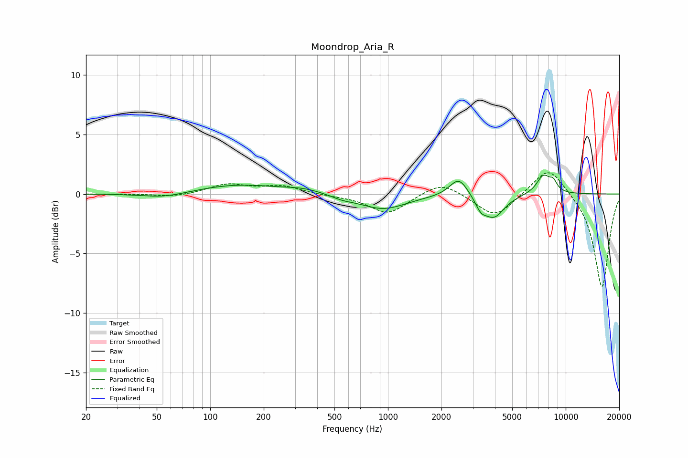

# Moondrop_Aria_R
See [usage instructions](https://github.com/jaakkopasanen/AutoEq#usage) for more options and info.

### Parametric EQs
Apply preamp of -1.7 dB when using parametric equalizer.

|   # | Type    |   Fc (Hz) |    Q |   Gain (dB) |
|-----|---------|-----------|------|-------------|
|   1 | Peaking |        55 | 1.11 |        -0.4 |
|   2 | Peaking |       144 | 0.61 |         0.8 |
|   3 | Peaking |       337 | 1.34 |         0.3 |
|   4 | Peaking |       553 | 2.29 |        -0.3 |
|   5 | Peaking |       936 | 1.06 |        -1.3 |
|   6 | Peaking |      2505 | 2.75 |         1.6 |
|   7 | Peaking |      3330 | 4.67 |        -0.8 |
|   8 | Peaking |      3946 | 2.36 |        -1.9 |
|   9 | Peaking |      7497 | 3.38 |         1.6 |
|  10 | Peaking |      8512 | 6    |         0.7 |

### Fixed Band EQs
When using fixed band (also called graphic) equalizer, apply preamp of **-1.9 dB** (if available) and set gains manually with these parameters.

|   # | Type    |   Fc (Hz) |    Q |   Gain (dB) |
|-----|---------|-----------|------|-------------|
|   1 | Peaking |        31 | 1.41 |         0   |
|   2 | Peaking |        62 | 1.41 |        -0.3 |
|   3 | Peaking |       125 | 1.41 |         0.8 |
|   4 | Peaking |       250 | 1.41 |         0.7 |
|   5 | Peaking |       500 | 1.41 |        -0.1 |
|   6 | Peaking |      1000 | 1.41 |        -1.7 |
|   7 | Peaking |      2000 | 1.41 |         1.1 |
|   8 | Peaking |      4000 | 1.41 |        -2   |
|   9 | Peaking |      8000 | 1.41 |         2.5 |
|  10 | Peaking |     16000 | 1.41 |        -7.9 |

### Graphs

