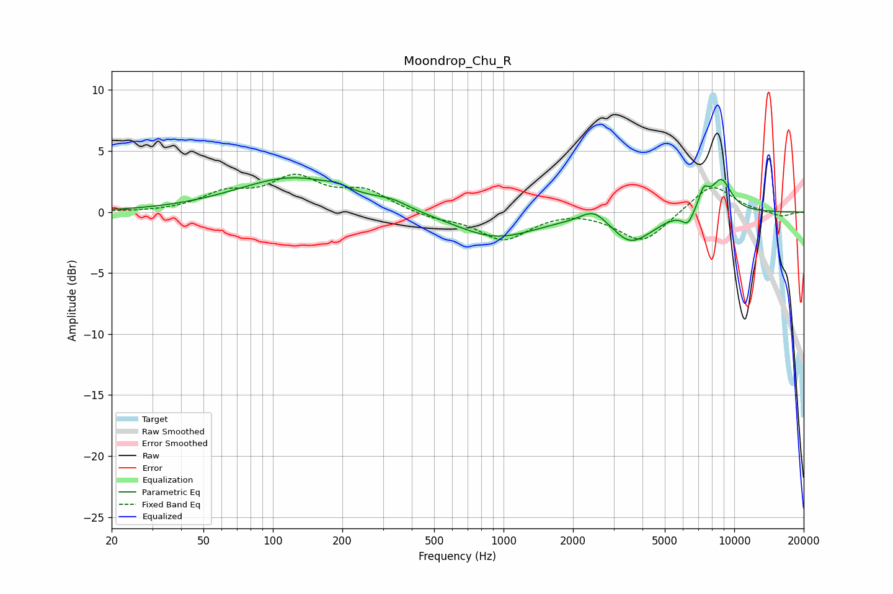

# Moondrop_Chu_R
See [usage instructions](https://github.com/jaakkopasanen/AutoEq#usage) for more options and info.

### Parametric EQs
Apply preamp of -2.9 dB when using parametric equalizer.

|   # | Type    |   Fc (Hz) |    Q |   Gain (dB) |
|-----|---------|-----------|------|-------------|
|   1 | Peaking |       124 | 0.58 |         2.8 |
|   2 | Peaking |       189 | 4.15 |         0.3 |
|   3 | Peaking |       329 | 2.13 |         0.5 |
|   4 | Peaking |       923 | 0.79 |        -2.1 |
|   5 | Peaking |      2455 | 2.61 |         1.1 |
|   6 | Peaking |      3532 | 1.84 |        -2.2 |
|   7 | Peaking |      4382 | 2.32 |        -0.4 |
|   8 | Peaking |      6287 | 5.48 |        -1.1 |
|   9 | Peaking |      7374 | 5.98 |         1.5 |
|  10 | Peaking |      8780 | 2.88 |         2.7 |

### Fixed Band EQs
When using fixed band (also called graphic) equalizer, apply preamp of **-3.2 dB** (if available) and set gains manually with these parameters.

|   # | Type    |   Fc (Hz) |    Q |   Gain (dB) |
|-----|---------|-----------|------|-------------|
|   1 | Peaking |        31 | 1.41 |        -0   |
|   2 | Peaking |        62 | 1.41 |         1.4 |
|   3 | Peaking |       125 | 1.41 |         2.6 |
|   4 | Peaking |       250 | 1.41 |         1.6 |
|   5 | Peaking |       500 | 1.41 |        -0.5 |
|   6 | Peaking |      1000 | 1.41 |        -2.2 |
|   7 | Peaking |      2000 | 1.41 |         0.2 |
|   8 | Peaking |      4000 | 1.41 |        -2.5 |
|   9 | Peaking |      8000 | 1.41 |         2.4 |
|  10 | Peaking |     16000 | 1.41 |        -0.4 |

### Graphs

