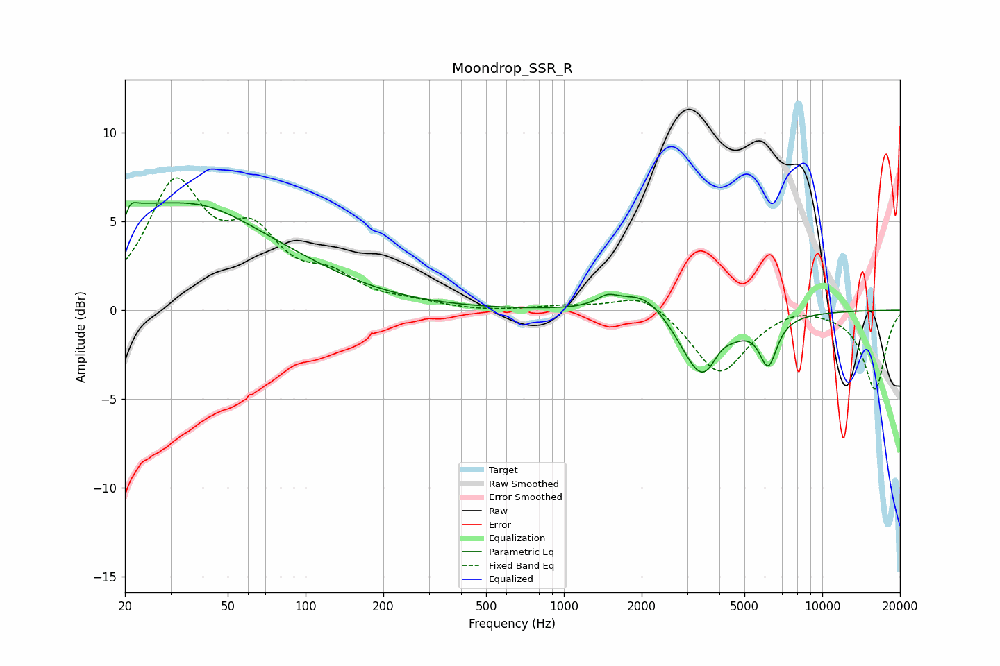

# Moondrop_SSR_R
See [usage instructions](https://github.com/jaakkopasanen/AutoEq#usage) for more options and info.

### Parametric EQs
Apply preamp of -6.1 dB when using parametric equalizer.

|   # | Type    |   Fc (Hz) |    Q |   Gain (dB) |
|-----|---------|-----------|------|-------------|
|   1 | Peaking |        20 | 5.98 |        -3.9 |
|   2 | Peaking |        20 | 0.21 |         5.8 |
|   3 | Peaking |        20 | 5.91 |         3.3 |
|   4 | Peaking |        42 | 0.96 |         0.7 |
|   5 | Peaking |      1473 | 3.28 |         0.6 |
|   6 | Peaking |      2047 | 1.55 |         1.3 |
|   7 | Peaking |      3415 | 1.74 |        -0.8 |
|   8 | Peaking |      3530 | 1.66 |        -3.5 |
|   9 | Peaking |      3990 | 3.07 |         1.1 |
|  10 | Peaking |      6180 | 4.05 |        -2.5 |

### Fixed Band EQs
When using fixed band (also called graphic) equalizer, apply preamp of **-7.5 dB** (if available) and set gains manually with these parameters.

|   # | Type    |   Fc (Hz) |    Q |   Gain (dB) |
|-----|---------|-----------|------|-------------|
|   1 | Peaking |        31 | 1.41 |         6.7 |
|   2 | Peaking |        62 | 1.41 |         3.6 |
|   3 | Peaking |       125 | 1.41 |         1.5 |
|   4 | Peaking |       250 | 1.41 |         0.3 |
|   5 | Peaking |       500 | 1.41 |        -0.1 |
|   6 | Peaking |      1000 | 1.41 |         0.2 |
|   7 | Peaking |      2000 | 1.41 |         1.1 |
|   8 | Peaking |      4000 | 1.41 |        -3.6 |
|   9 | Peaking |      8000 | 1.41 |         0.4 |
|  10 | Peaking |     16000 | 1.41 |        -4.4 |

### Graphs

