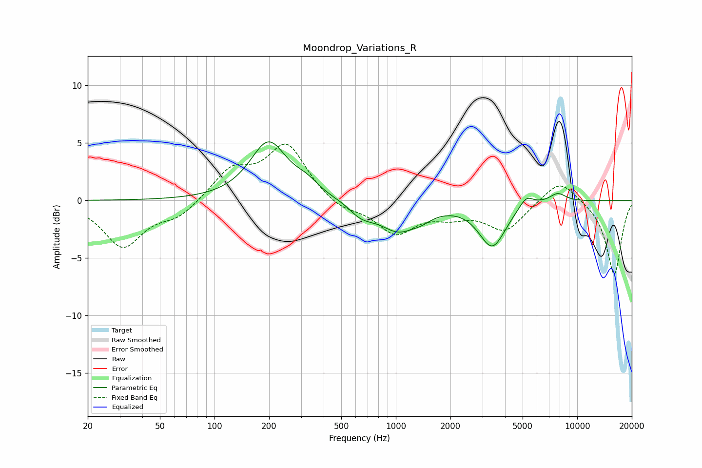

# Moondrop_Variations_R
See [usage instructions](https://github.com/jaakkopasanen/AutoEq#usage) for more options and info.

### Parametric EQs
Apply preamp of -5.2 dB when using parametric equalizer.

|   # | Type    |   Fc (Hz) |    Q |   Gain (dB) |
|-----|---------|-----------|------|-------------|
|   1 | Peaking |       199 | 1.4  |         5   |
|   2 | Peaking |       322 | 2.07 |         0.9 |
|   3 | Peaking |       610 | 2.88 |        -0.4 |
|   4 | Peaking |       677 | 2.14 |        -0.7 |
|   5 | Peaking |      1057 | 1.32 |        -2.8 |
|   6 | Peaking |      1146 | 1.87 |         0.4 |
|   7 | Peaking |      1391 | 2.72 |        -0.4 |
|   8 | Peaking |      3401 | 1.91 |        -3.9 |
|   9 | Peaking |      5238 | 3.51 |         1   |
|  10 | Peaking |      7808 | 2.9  |         0.8 |

### Fixed Band EQs
When using fixed band (also called graphic) equalizer, apply preamp of **-5.0 dB** (if available) and set gains manually with these parameters.

|   # | Type    |   Fc (Hz) |    Q |   Gain (dB) |
|-----|---------|-----------|------|-------------|
|   1 | Peaking |        31 | 1.41 |        -4   |
|   2 | Peaking |        62 | 1.41 |        -1.3 |
|   3 | Peaking |       125 | 1.41 |         2.5 |
|   4 | Peaking |       250 | 1.41 |         4.8 |
|   5 | Peaking |       500 | 1.41 |        -0.9 |
|   6 | Peaking |      1000 | 1.41 |        -2.7 |
|   7 | Peaking |      2000 | 1.41 |        -1   |
|   8 | Peaking |      4000 | 1.41 |        -2.5 |
|   9 | Peaking |      8000 | 1.41 |         2   |
|  10 | Peaking |     16000 | 1.41 |        -6.5 |

### Graphs

