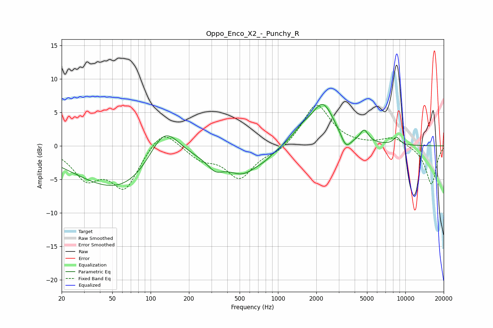

# Oppo_Enco_X2_-_Punchy_R
See [usage instructions](https://github.com/jaakkopasanen/AutoEq#usage) for more options and info.

### Parametric EQs
Apply preamp of -6.3 dB when using parametric equalizer.

|   # | Type    |   Fc (Hz) |    Q |   Gain (dB) |
|-----|---------|-----------|------|-------------|
|   1 | Peaking |        68 | 0.36 |        -7.7 |
|   2 | Peaking |       128 | 1.02 |         7.8 |
|   3 | Peaking |       322 | 2.32 |        -1.7 |
|   4 | Peaking |       530 | 1.13 |        -3.5 |
|   5 | Peaking |       788 | 2.13 |        -0.6 |
|   6 | Peaking |      1537 | 1.92 |         1.5 |
|   7 | Peaking |      2251 | 1.56 |         6.1 |
|   8 | Peaking |      3419 | 3.58 |        -2.1 |
|   9 | Peaking |      4751 | 4.3  |         1.8 |
|  10 | Peaking |      8544 | 4.83 |         1.1 |

### Fixed Band EQs
When using fixed band (also called graphic) equalizer, apply preamp of **-6.2 dB** (if available) and set gains manually with these parameters.

|   # | Type    |   Fc (Hz) |    Q |   Gain (dB) |
|-----|---------|-----------|------|-------------|
|   1 | Peaking |        31 | 1.41 |        -4.4 |
|   2 | Peaking |        62 | 1.41 |        -6.1 |
|   3 | Peaking |       125 | 1.41 |         3.1 |
|   4 | Peaking |       250 | 1.41 |        -1.8 |
|   5 | Peaking |       500 | 1.41 |        -4.7 |
|   6 | Peaking |      1000 | 1.41 |        -1   |
|   7 | Peaking |      2000 | 1.41 |         6.4 |
|   8 | Peaking |      4000 | 1.41 |         0   |
|   9 | Peaking |      8000 | 1.41 |         1.3 |
|  10 | Peaking |     16000 | 1.41 |        -5.8 |

### Graphs

