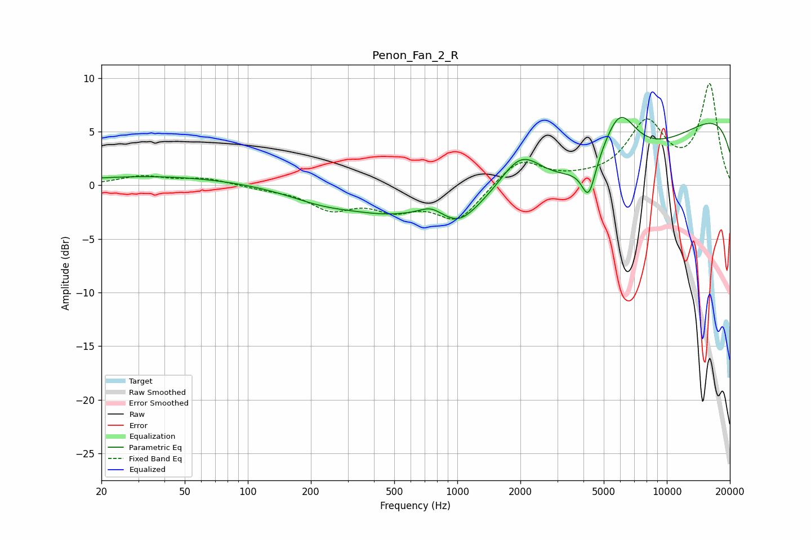

# Penon_Fan_2_R
See [usage instructions](https://github.com/jaakkopasanen/AutoEq#usage) for more options and info.

### Parametric EQs
Apply preamp of -6.4 dB when using parametric equalizer.

|   # | Type    |   Fc (Hz) |    Q |   Gain (dB) |
|-----|---------|-----------|------|-------------|
|   1 | Peaking |        37 | 0.37 |         0.9 |
|   2 | Peaking |       229 | 0.8  |        -1.2 |
|   3 | Peaking |       451 | 0.78 |        -1.4 |
|   4 | Peaking |       745 | 2.72 |         0.7 |
|   5 | Peaking |      1022 | 1.76 |        -1.6 |
|   6 | Peaking |      2005 | 1.29 |         4.5 |
|   7 | Peaking |      4236 | 4.25 |        -3.4 |
|   8 | Peaking |      4425 | 0.22 |        -7.7 |
|   9 | Peaking |      5931 | 1.71 |         4.8 |
|  10 | Peaking |     10000 | 0.18 |         9.6 |

### Fixed Band EQs
When using fixed band (also called graphic) equalizer, apply preamp of **-9.6 dB** (if available) and set gains manually with these parameters.

|   # | Type    |   Fc (Hz) |    Q |   Gain (dB) |
|-----|---------|-----------|------|-------------|
|   1 | Peaking |        31 | 1.41 |         0.8 |
|   2 | Peaking |        62 | 1.41 |         0.6 |
|   3 | Peaking |       125 | 1.41 |        -0.3 |
|   4 | Peaking |       250 | 1.41 |        -2   |
|   5 | Peaking |       500 | 1.41 |        -1.9 |
|   6 | Peaking |      1000 | 1.41 |        -3.2 |
|   7 | Peaking |      2000 | 1.41 |         2.5 |
|   8 | Peaking |      4000 | 1.41 |         0.3 |
|   9 | Peaking |      8000 | 1.41 |         5.6 |
|  10 | Peaking |     16000 | 1.41 |         9.2 |

### Graphs

