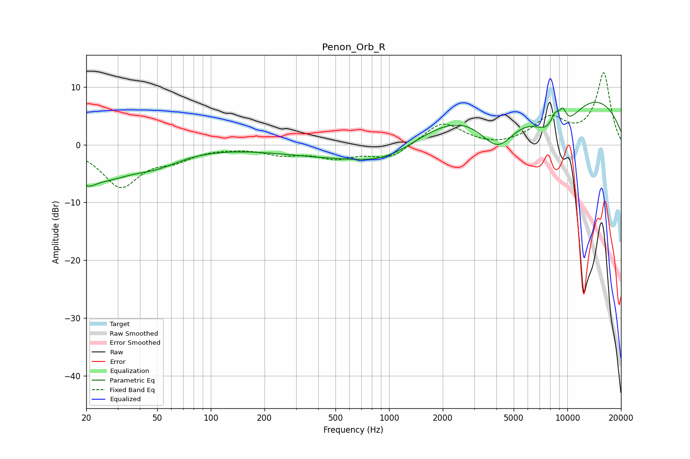

# Penon_Orb_R
See [usage instructions](https://github.com/jaakkopasanen/AutoEq#usage) for more options and info.

### Parametric EQs
Apply preamp of -7.4 dB when using parametric equalizer.

|   # | Type    |   Fc (Hz) |    Q |   Gain (dB) |
|-----|---------|-----------|------|-------------|
|   1 | Peaking |        20 | 3.3  |        -2.2 |
|   2 | Peaking |        24 | 0.85 |        -5   |
|   3 | Peaking |        50 | 0.98 |        -2.3 |
|   4 | Peaking |       539 | 0.39 |        -2   |
|   5 | Peaking |      1010 | 0.72 |        -3.5 |
|   6 | Peaking |      4073 | 1.21 |        -8.5 |
|   7 | Peaking |      7411 | 0.19 |        12.2 |
|   8 | Peaking |      8552 | 4.11 |         4.2 |
|   9 | Peaking |      8670 | 1.1  |       -10.1 |
|  10 | Peaking |      9437 | 5.63 |         3   |

### Fixed Band EQs
When using fixed band (also called graphic) equalizer, apply preamp of **-12.6 dB** (if available) and set gains manually with these parameters.

|   # | Type    |   Fc (Hz) |    Q |   Gain (dB) |
|-----|---------|-----------|------|-------------|
|   1 | Peaking |        31 | 1.41 |        -7.1 |
|   2 | Peaking |        62 | 1.41 |        -2   |
|   3 | Peaking |       125 | 1.41 |        -0.2 |
|   4 | Peaking |       250 | 1.41 |        -1.4 |
|   5 | Peaking |       500 | 1.41 |        -2   |
|   6 | Peaking |      1000 | 1.41 |        -2.4 |
|   7 | Peaking |      2000 | 1.41 |         4   |
|   8 | Peaking |      4000 | 1.41 |        -0.5 |
|   9 | Peaking |      8000 | 1.41 |         4.3 |
|  10 | Peaking |     16000 | 1.41 |        12.3 |

### Graphs

