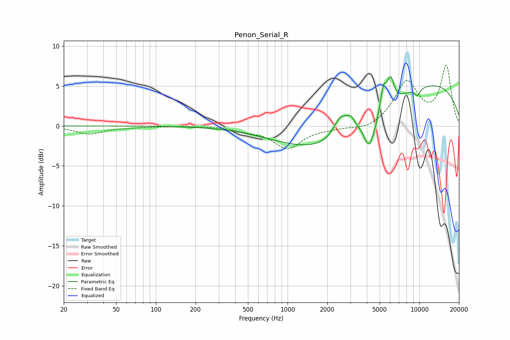

# Penon_Serial_R
See [usage instructions](https://github.com/jaakkopasanen/AutoEq#usage) for more options and info.

### Parametric EQs
Apply preamp of -6.3 dB when using parametric equalizer.

|   # | Type    |   Fc (Hz) |    Q |   Gain (dB) |
|-----|---------|-----------|------|-------------|
|   1 | Peaking |      2396 | 0.38 |        -5.9 |
|   2 | Peaking |      2517 | 2.66 |         2.6 |
|   3 | Peaking |      3009 | 4.48 |         1.3 |
|   4 | Peaking |      4154 | 3.88 |        -3.3 |
|   5 | Peaking |      4670 | 3.6  |        -0.8 |
|   6 | Peaking |      5337 | 5.75 |         3   |
|   7 | Peaking |      6029 | 2.88 |        -0.1 |
|   8 | Peaking |      6054 | 5.4  |         3.1 |
|   9 | Peaking |      8392 | 0.2  |         6.2 |
|  10 | Peaking |      9671 | 5.97 |        -0.9 |

### Fixed Band EQs
When using fixed band (also called graphic) equalizer, apply preamp of **-7.7 dB** (if available) and set gains manually with these parameters.

|   # | Type    |   Fc (Hz) |    Q |   Gain (dB) |
|-----|---------|-----------|------|-------------|
|   1 | Peaking |        31 | 1.41 |        -1   |
|   2 | Peaking |        62 | 1.41 |        -0.1 |
|   3 | Peaking |       125 | 1.41 |        -0   |
|   4 | Peaking |       250 | 1.41 |         0   |
|   5 | Peaking |       500 | 1.41 |        -0.5 |
|   6 | Peaking |      1000 | 1.41 |        -2.7 |
|   7 | Peaking |      2000 | 1.41 |        -0.3 |
|   8 | Peaking |      4000 | 1.41 |        -0.6 |
|   9 | Peaking |      8000 | 1.41 |         5.4 |
|  10 | Peaking |     16000 | 1.41 |         7.3 |

### Graphs

