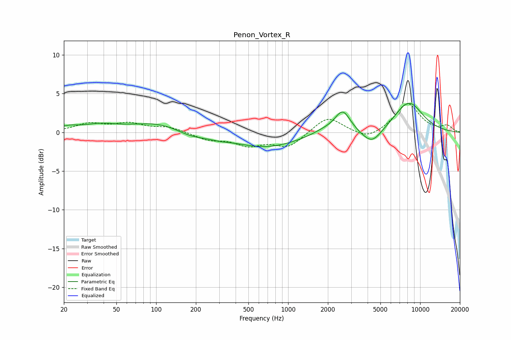

# Penon_Vortex_R
See [usage instructions](https://github.com/jaakkopasanen/AutoEq#usage) for more options and info.

### Parametric EQs
Apply preamp of -3.8 dB when using parametric equalizer.

|   # | Type    |   Fc (Hz) |    Q |   Gain (dB) |
|-----|---------|-----------|------|-------------|
|   1 | Peaking |        22 | 1.92 |         0.5 |
|   2 | Peaking |        37 | 1.15 |         0.8 |
|   3 | Peaking |       112 | 0.61 |         1.4 |
|   4 | Peaking |       181 | 1.12 |        -1   |
|   5 | Peaking |       297 | 1.89 |        -0.3 |
|   6 | Peaking |       670 | 0.55 |        -1.9 |
|   7 | Peaking |      1877 | 1.39 |         0.6 |
|   8 | Peaking |      2589 | 2.41 |         2.8 |
|   9 | Peaking |      4310 | 1.85 |        -2   |
|  10 | Peaking |      8192 | 1.18 |         3.9 |

### Fixed Band EQs
When using fixed band (also called graphic) equalizer, apply preamp of **-3.8 dB** (if available) and set gains manually with these parameters.

|   # | Type    |   Fc (Hz) |    Q |   Gain (dB) |
|-----|---------|-----------|------|-------------|
|   1 | Peaking |        31 | 1.41 |         1.1 |
|   2 | Peaking |        62 | 1.41 |         1   |
|   3 | Peaking |       125 | 1.41 |         0.7 |
|   4 | Peaking |       250 | 1.41 |        -0.9 |
|   5 | Peaking |       500 | 1.41 |        -1.5 |
|   6 | Peaking |      1000 | 1.41 |        -1.9 |
|   7 | Peaking |      2000 | 1.41 |         2.1 |
|   8 | Peaking |      4000 | 1.41 |        -1.1 |
|   9 | Peaking |      8000 | 1.41 |         3.7 |
|  10 | Peaking |     16000 | 1.41 |         0.8 |

### Graphs

