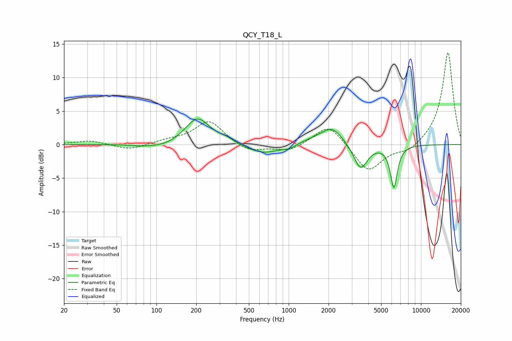

# QCY_T18_L
See [usage instructions](https://github.com/jaakkopasanen/AutoEq#usage) for more options and info.

### Parametric EQs
Apply preamp of -3.9 dB when using parametric equalizer.

|   # | Type    |   Fc (Hz) |    Q |   Gain (dB) |
|-----|---------|-----------|------|-------------|
|   1 | Peaking |        77 | 1.67 |        -0.2 |
|   2 | Peaking |       115 | 1.17 |        -0.6 |
|   3 | Peaking |       204 | 1.51 |         4.1 |
|   4 | Peaking |       337 | 2.37 |         0.5 |
|   5 | Peaking |       646 | 1.14 |        -1.5 |
|   6 | Peaking |      1012 | 3.09 |        -0.5 |
|   7 | Peaking |      1635 | 1.17 |         0.8 |
|   8 | Peaking |      2148 | 1.85 |         2.2 |
|   9 | Peaking |      3493 | 2.72 |        -3.8 |
|  10 | Peaking |      6238 | 5.17 |        -6.2 |

### Fixed Band EQs
When using fixed band (also called graphic) equalizer, apply preamp of **-13.8 dB** (if available) and set gains manually with these parameters.

|   # | Type    |   Fc (Hz) |    Q |   Gain (dB) |
|-----|---------|-----------|------|-------------|
|   1 | Peaking |        31 | 1.41 |         0.6 |
|   2 | Peaking |        62 | 1.41 |        -0.8 |
|   3 | Peaking |       125 | 1.41 |         0.5 |
|   4 | Peaking |       250 | 1.41 |         3.6 |
|   5 | Peaking |       500 | 1.41 |        -1.2 |
|   6 | Peaking |      1000 | 1.41 |        -1   |
|   7 | Peaking |      2000 | 1.41 |         3.2 |
|   8 | Peaking |      4000 | 1.41 |        -4.2 |
|   9 | Peaking |      8000 | 1.41 |        -1.2 |
|  10 | Peaking |     16000 | 1.41 |        13.9 |

### Graphs

