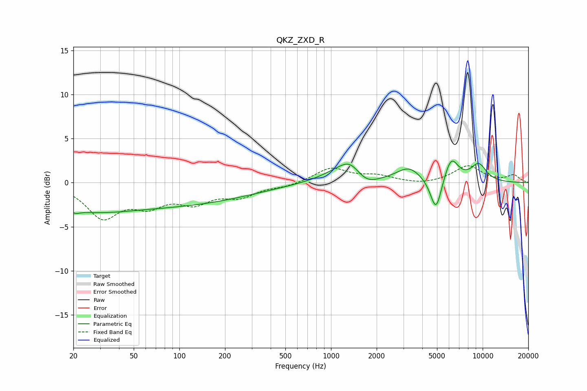

# QKZ_ZXD_R
See [usage instructions](https://github.com/jaakkopasanen/AutoEq#usage) for more options and info.

### Parametric EQs
Apply preamp of -2.5 dB when using parametric equalizer.

|   # | Type    |   Fc (Hz) |    Q |   Gain (dB) |
|-----|---------|-----------|------|-------------|
|   1 | Peaking |        21 | 5.28 |        -0.3 |
|   2 | Peaking |        24 | 0.59 |        -0.9 |
|   3 | Peaking |        56 | 0.18 |        -2.7 |
|   4 | Peaking |      1284 | 1.04 |         2   |
|   5 | Peaking |      1339 | 2.3  |         1   |
|   6 | Peaking |      1695 | 1.72 |        -1.5 |
|   7 | Peaking |      3265 | 1.77 |         1.6 |
|   8 | Peaking |      4926 | 3.75 |        -3.9 |
|   9 | Peaking |      6201 | 2.96 |         2.7 |
|  10 | Peaking |      9409 | 2.35 |         2   |

### Fixed Band EQs
When using fixed band (also called graphic) equalizer, apply preamp of **-2.0 dB** (if available) and set gains manually with these parameters.

|   # | Type    |   Fc (Hz) |    Q |   Gain (dB) |
|-----|---------|-----------|------|-------------|
|   1 | Peaking |        31 | 1.41 |        -3.7 |
|   2 | Peaking |        62 | 1.41 |        -2.1 |
|   3 | Peaking |       125 | 1.41 |        -2   |
|   4 | Peaking |       250 | 1.41 |        -1.4 |
|   5 | Peaking |       500 | 1.41 |        -0.4 |
|   6 | Peaking |      1000 | 1.41 |         1.6 |
|   7 | Peaking |      2000 | 1.41 |         0.7 |
|   8 | Peaking |      4000 | 1.41 |        -0.3 |
|   9 | Peaking |      8000 | 1.41 |         1.9 |
|  10 | Peaking |     16000 | 1.41 |         0.8 |

### Graphs

