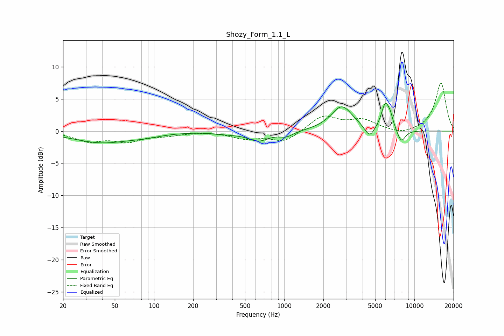

# Shozy_Form_1.1_L
See [usage instructions](https://github.com/jaakkopasanen/AutoEq#usage) for more options and info.

### Parametric EQs
Apply preamp of -4.4 dB when using parametric equalizer.

|   # | Type    |   Fc (Hz) |    Q |   Gain (dB) |
|-----|---------|-----------|------|-------------|
|   1 | Peaking |        40 | 0.64 |        -1.8 |
|   2 | Peaking |        87 | 1.28 |        -0.4 |
|   3 | Peaking |       370 | 1.44 |        -0.3 |
|   4 | Peaking |       634 | 1.78 |        -1.4 |
|   5 | Peaking |      1039 | 2.62 |        -0.8 |
|   6 | Peaking |      2772 | 1.7  |         3.9 |
|   7 | Peaking |      4533 | 3.83 |        -1.8 |
|   8 | Peaking |      5973 | 4.42 |         3.9 |
|   9 | Peaking |      6538 | 5.99 |         1.4 |
|  10 | Peaking |      7929 | 4.04 |        -2   |

### Fixed Band EQs
When using fixed band (also called graphic) equalizer, apply preamp of **-7.5 dB** (if available) and set gains manually with these parameters.

|   # | Type    |   Fc (Hz) |    Q |   Gain (dB) |
|-----|---------|-----------|------|-------------|
|   1 | Peaking |        31 | 1.41 |        -1.5 |
|   2 | Peaking |        62 | 1.41 |        -1.5 |
|   3 | Peaking |       125 | 1.41 |        -0.5 |
|   4 | Peaking |       250 | 1.41 |        -0   |
|   5 | Peaking |       500 | 1.41 |        -1   |
|   6 | Peaking |      1000 | 1.41 |        -1.7 |
|   7 | Peaking |      2000 | 1.41 |         2.4 |
|   8 | Peaking |      4000 | 1.41 |         1.6 |
|   9 | Peaking |      8000 | 1.41 |        -0.6 |
|  10 | Peaking |     16000 | 1.41 |         7.5 |

### Graphs

