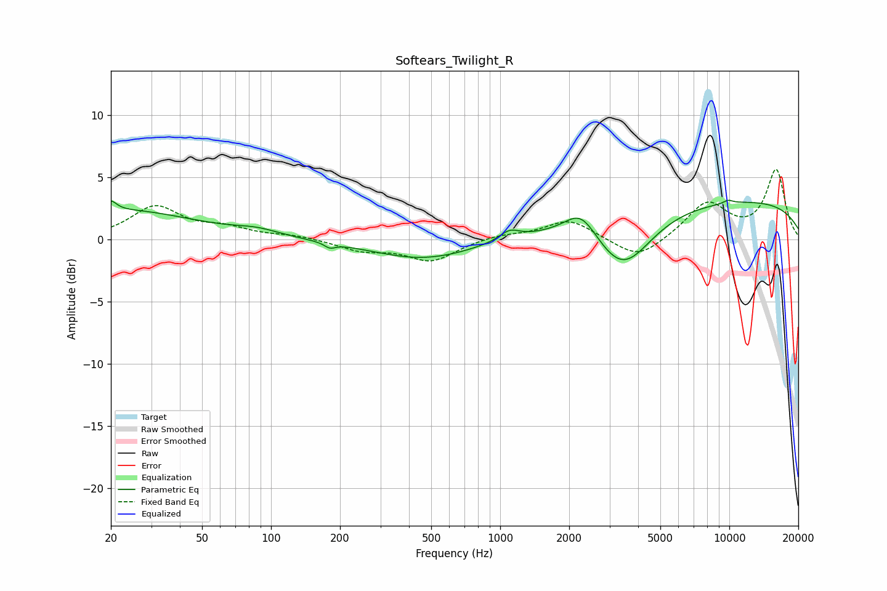

# Softears_Twilight_R
See [usage instructions](https://github.com/jaakkopasanen/AutoEq#usage) for more options and info.

### Parametric EQs
Apply preamp of -3.3 dB when using parametric equalizer.

|   # | Type    |   Fc (Hz) |    Q |   Gain (dB) |
|-----|---------|-----------|------|-------------|
|   1 | Peaking |        20 | 5.82 |         0.8 |
|   2 | Peaking |        22 | 0.43 |         2.3 |
|   3 | Peaking |        87 | 1.46 |         0.5 |
|   4 | Peaking |       181 | 5.97 |        -0.4 |
|   5 | Peaking |       466 | 0.63 |        -1.6 |
|   6 | Peaking |      1099 | 3.24 |         0.8 |
|   7 | Peaking |      2252 | 2.02 |         2.1 |
|   8 | Peaking |      3430 | 1.13 |        -4.7 |
|   9 | Peaking |      8928 | 0.18 |         3.3 |
|  10 | Peaking |      9874 | 5.89 |         0.3 |

### Fixed Band EQs
When using fixed band (also called graphic) equalizer, apply preamp of **-5.7 dB** (if available) and set gains manually with these parameters.

|   # | Type    |   Fc (Hz) |    Q |   Gain (dB) |
|-----|---------|-----------|------|-------------|
|   1 | Peaking |        31 | 1.41 |         2.6 |
|   2 | Peaking |        62 | 1.41 |         0.8 |
|   3 | Peaking |       125 | 1.41 |         0.3 |
|   4 | Peaking |       250 | 1.41 |        -0.8 |
|   5 | Peaking |       500 | 1.41 |        -1.7 |
|   6 | Peaking |      1000 | 1.41 |         0.4 |
|   7 | Peaking |      2000 | 1.41 |         1.6 |
|   8 | Peaking |      4000 | 1.41 |        -1.7 |
|   9 | Peaking |      8000 | 1.41 |         2.9 |
|  10 | Peaking |     16000 | 1.41 |         5.5 |

### Graphs

