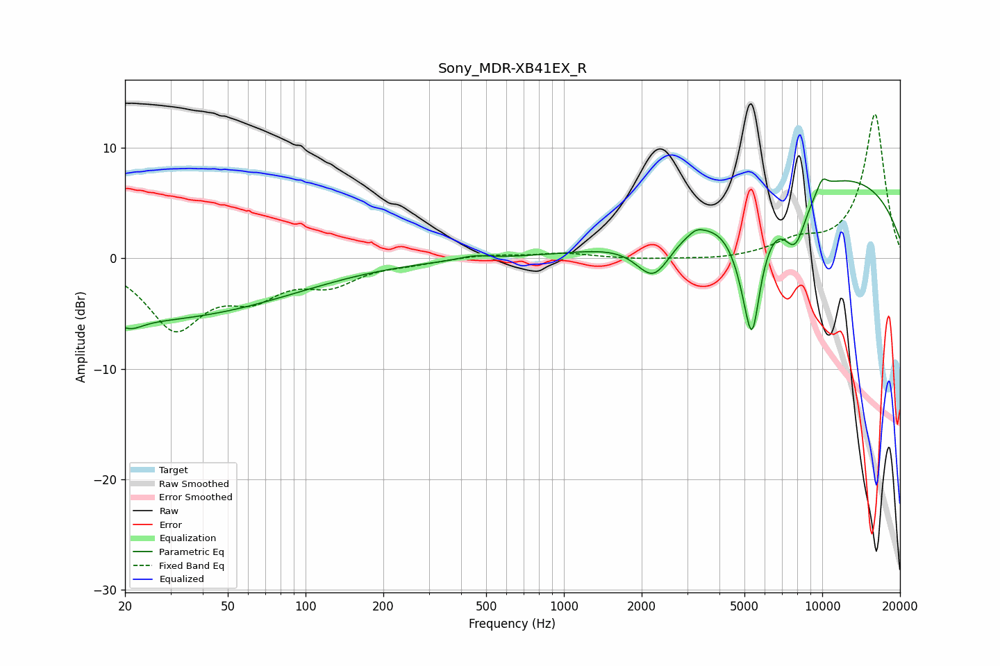

# Sony_MDR-XB41EX_R
See [usage instructions](https://github.com/jaakkopasanen/AutoEq#usage) for more options and info.

### Parametric EQs
Apply preamp of -7.3 dB when using parametric equalizer.

|   # | Type    |   Fc (Hz) |    Q |   Gain (dB) |
|-----|---------|-----------|------|-------------|
|   1 | Peaking |        21 | 3.11 |        -0.8 |
|   2 | Peaking |        21 | 0.21 |        -5.6 |
|   3 | Peaking |       449 | 2.51 |         0.4 |
|   4 | Peaking |      2228 | 2.04 |        -3.9 |
|   5 | Peaking |      3253 | 5.38 |         0.4 |
|   6 | Peaking |      5239 | 2.54 |        -8   |
|   7 | Peaking |      5367 | 5.72 |        -4.2 |
|   8 | Peaking |      7856 | 2.72 |        -4.8 |
|   9 | Peaking |     10000 | 0.24 |         7.7 |
|  10 | Peaking |     10000 | 6    |         1.1 |

### Fixed Band EQs
When using fixed band (also called graphic) equalizer, apply preamp of **-13.2 dB** (if available) and set gains manually with these parameters.

|   # | Type    |   Fc (Hz) |    Q |   Gain (dB) |
|-----|---------|-----------|------|-------------|
|   1 | Peaking |        31 | 1.41 |        -6.1 |
|   2 | Peaking |        62 | 1.41 |        -2.8 |
|   3 | Peaking |       125 | 1.41 |        -2   |
|   4 | Peaking |       250 | 1.41 |        -0.3 |
|   5 | Peaking |       500 | 1.41 |         0.3 |
|   6 | Peaking |      1000 | 1.41 |         0.5 |
|   7 | Peaking |      2000 | 1.41 |        -0.1 |
|   8 | Peaking |      4000 | 1.41 |        -0.2 |
|   9 | Peaking |      8000 | 1.41 |         1.3 |
|  10 | Peaking |     16000 | 1.41 |        13.1 |

### Graphs

