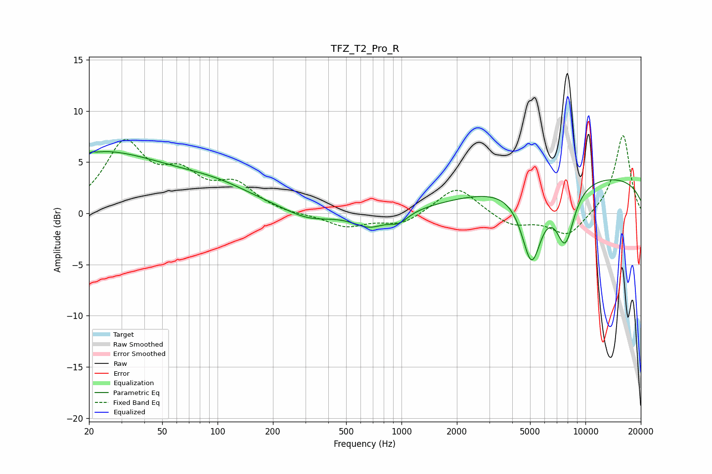

# TFZ_T2_Pro_R
See [usage instructions](https://github.com/jaakkopasanen/AutoEq#usage) for more options and info.

### Parametric EQs
Apply preamp of -6.1 dB when using parametric equalizer.

|   # | Type    |   Fc (Hz) |    Q |   Gain (dB) |
|-----|---------|-----------|------|-------------|
|   1 | Peaking |        20 | 0.32 |         6   |
|   2 | Peaking |        20 | 5.21 |        -3.6 |
|   3 | Peaking |        20 | 5.76 |         3.3 |
|   4 | Peaking |       101 | 0.64 |         1.6 |
|   5 | Peaking |       311 | 1.16 |        -0.9 |
|   6 | Peaking |       670 | 1.61 |        -1.4 |
|   7 | Peaking |       967 | 2.7  |        -1   |
|   8 | Peaking |      5092 | 2.53 |        -7.2 |
|   9 | Peaking |      7761 | 2.61 |        -5.5 |
|  10 | Peaking |      9922 | 0.18 |         3.7 |

### Fixed Band EQs
When using fixed band (also called graphic) equalizer, apply preamp of **-7.7 dB** (if available) and set gains manually with these parameters.

|   # | Type    |   Fc (Hz) |    Q |   Gain (dB) |
|-----|---------|-----------|------|-------------|
|   1 | Peaking |        31 | 1.41 |         6.5 |
|   2 | Peaking |        62 | 1.41 |         3.1 |
|   3 | Peaking |       125 | 1.41 |         2.5 |
|   4 | Peaking |       250 | 1.41 |        -0.2 |
|   5 | Peaking |       500 | 1.41 |        -1.3 |
|   6 | Peaking |      1000 | 1.41 |        -1.1 |
|   7 | Peaking |      2000 | 1.41 |         2.7 |
|   8 | Peaking |      4000 | 1.41 |        -1.2 |
|   9 | Peaking |      8000 | 1.41 |        -2.3 |
|  10 | Peaking |     16000 | 1.41 |         7.8 |

### Graphs

