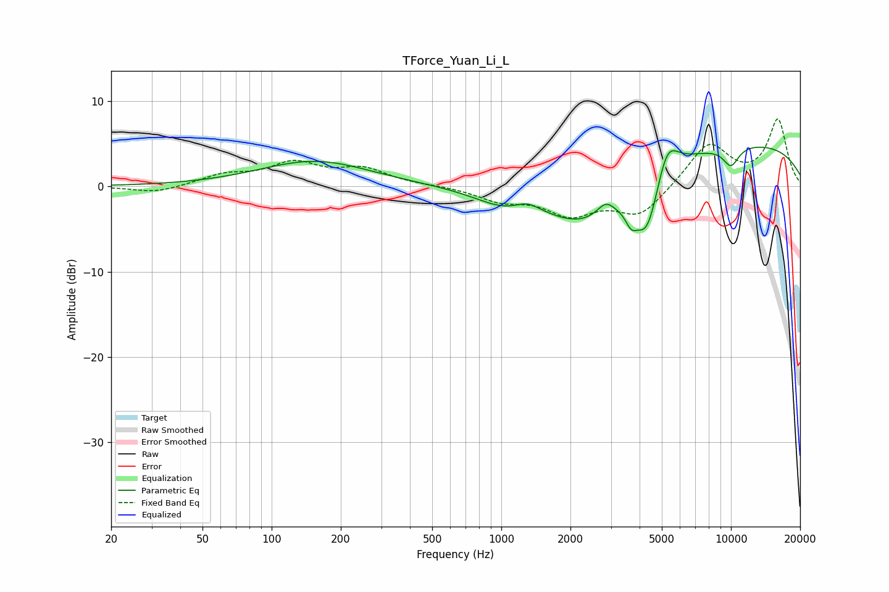

# TForce_Yuan_Li_L
See [usage instructions](https://github.com/jaakkopasanen/AutoEq#usage) for more options and info.

### Parametric EQs
Apply preamp of -4.7 dB when using parametric equalizer.

|   # | Type    |   Fc (Hz) |    Q |   Gain (dB) |
|-----|---------|-----------|------|-------------|
|   1 | Peaking |       154 | 0.59 |         3   |
|   2 | Peaking |      1010 | 1.16 |        -1.5 |
|   3 | Peaking |      1302 | 2.59 |         1   |
|   4 | Peaking |      2351 | 0.72 |        -6   |
|   5 | Peaking |      2848 | 3.61 |         1.6 |
|   6 | Peaking |      3674 | 5.94 |        -1.5 |
|   7 | Peaking |      4313 | 2.36 |        -7.3 |
|   8 | Peaking |      5254 | 2.8  |         4.7 |
|   9 | Peaking |      9714 | 0.21 |         5.3 |
|  10 | Peaking |     10000 | 3.45 |        -2.3 |

### Fixed Band EQs
When using fixed band (also called graphic) equalizer, apply preamp of **-8.0 dB** (if available) and set gains manually with these parameters.

|   # | Type    |   Fc (Hz) |    Q |   Gain (dB) |
|-----|---------|-----------|------|-------------|
|   1 | Peaking |        31 | 1.41 |        -0.8 |
|   2 | Peaking |        62 | 1.41 |         1.2 |
|   3 | Peaking |       125 | 1.41 |         2.5 |
|   4 | Peaking |       250 | 1.41 |         1.9 |
|   5 | Peaking |       500 | 1.41 |         0.1 |
|   6 | Peaking |      1000 | 1.41 |        -1.5 |
|   7 | Peaking |      2000 | 1.41 |        -3   |
|   8 | Peaking |      4000 | 1.41 |        -3.4 |
|   9 | Peaking |      8000 | 1.41 |         5   |
|  10 | Peaking |     16000 | 1.41 |         7.7 |

### Graphs

