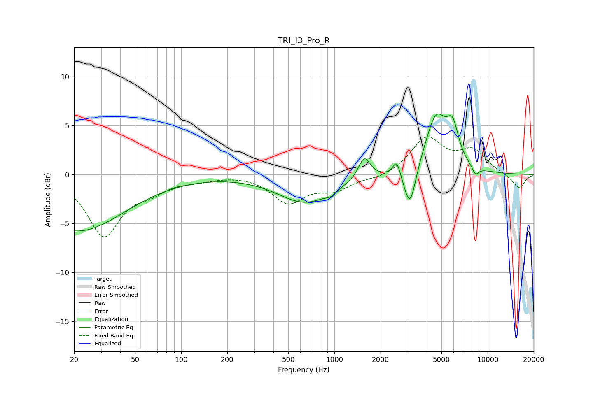

# TRI_I3_Pro_R
See [usage instructions](https://github.com/jaakkopasanen/AutoEq#usage) for more options and info.

### Parametric EQs
Apply preamp of -6.3 dB when using parametric equalizer.

|   # | Type    |   Fc (Hz) |    Q |   Gain (dB) |
|-----|---------|-----------|------|-------------|
|   1 | Peaking |        20 | 0.57 |        -1.5 |
|   2 | Peaking |        22 | 0.43 |        -4.2 |
|   3 | Peaking |       646 | 0.79 |        -2.8 |
|   4 | Peaking |       946 | 4.69 |        -0.4 |
|   5 | Peaking |      1567 | 3.69 |         2.3 |
|   6 | Peaking |      2552 | 6    |         1.6 |
|   7 | Peaking |      3114 | 3.7  |        -4.3 |
|   8 | Peaking |      4614 | 1.93 |         5.8 |
|   9 | Peaking |      5920 | 3.53 |         3.3 |
|  10 | Peaking |      8335 | 6    |        -0.9 |

### Fixed Band EQs
When using fixed band (also called graphic) equalizer, apply preamp of **-3.9 dB** (if available) and set gains manually with these parameters.

|   # | Type    |   Fc (Hz) |    Q |   Gain (dB) |
|-----|---------|-----------|------|-------------|
|   1 | Peaking |        31 | 1.41 |        -6.1 |
|   2 | Peaking |        62 | 1.41 |        -1.3 |
|   3 | Peaking |       125 | 1.41 |        -0.4 |
|   4 | Peaking |       250 | 1.41 |         0.1 |
|   5 | Peaking |       500 | 1.41 |        -2.8 |
|   6 | Peaking |      1000 | 1.41 |        -1.4 |
|   7 | Peaking |      2000 | 1.41 |        -0.4 |
|   8 | Peaking |      4000 | 1.41 |         3.7 |
|   9 | Peaking |      8000 | 1.41 |         2.3 |
|  10 | Peaking |     16000 | 1.41 |        -1.5 |

### Graphs

