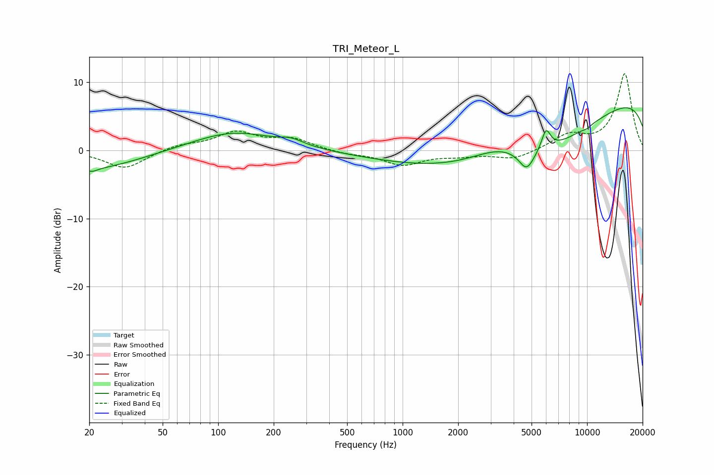

# TRI_Meteor_L
See [usage instructions](https://github.com/jaakkopasanen/AutoEq#usage) for more options and info.

### Parametric EQs
Apply preamp of -6.4 dB when using parametric equalizer.

|   # | Type    |   Fc (Hz) |    Q |   Gain (dB) |
|-----|---------|-----------|------|-------------|
|   1 | Peaking |        20 | 0.54 |        -2.8 |
|   2 | Peaking |        21 | 5.1  |        -0.5 |
|   3 | Peaking |       121 | 0.63 |         2.8 |
|   4 | Peaking |       250 | 2.13 |         0.8 |
|   5 | Peaking |      3382 | 0.85 |         3   |
|   6 | Peaking |      4700 | 3.36 |        -2.9 |
|   7 | Peaking |      5024 | 0.26 |       -14.1 |
|   8 | Peaking |      5993 | 5.56 |         3   |
|   9 | Peaking |      9278 | 0.19 |        14   |
|  10 | Peaking |     10000 | 5.96 |        -0.3 |

### Fixed Band EQs
When using fixed band (also called graphic) equalizer, apply preamp of **-11.3 dB** (if available) and set gains manually with these parameters.

|   # | Type    |   Fc (Hz) |    Q |   Gain (dB) |
|-----|---------|-----------|------|-------------|
|   1 | Peaking |        31 | 1.41 |        -2.7 |
|   2 | Peaking |        62 | 1.41 |         0.8 |
|   3 | Peaking |       125 | 1.41 |         2.5 |
|   4 | Peaking |       250 | 1.41 |         1.6 |
|   5 | Peaking |       500 | 1.41 |        -0.5 |
|   6 | Peaking |      1000 | 1.41 |        -2   |
|   7 | Peaking |      2000 | 1.41 |        -0.6 |
|   8 | Peaking |      4000 | 1.41 |        -1.3 |
|   9 | Peaking |      8000 | 1.41 |         2.1 |
|  10 | Peaking |     16000 | 1.41 |        11.2 |

### Graphs

