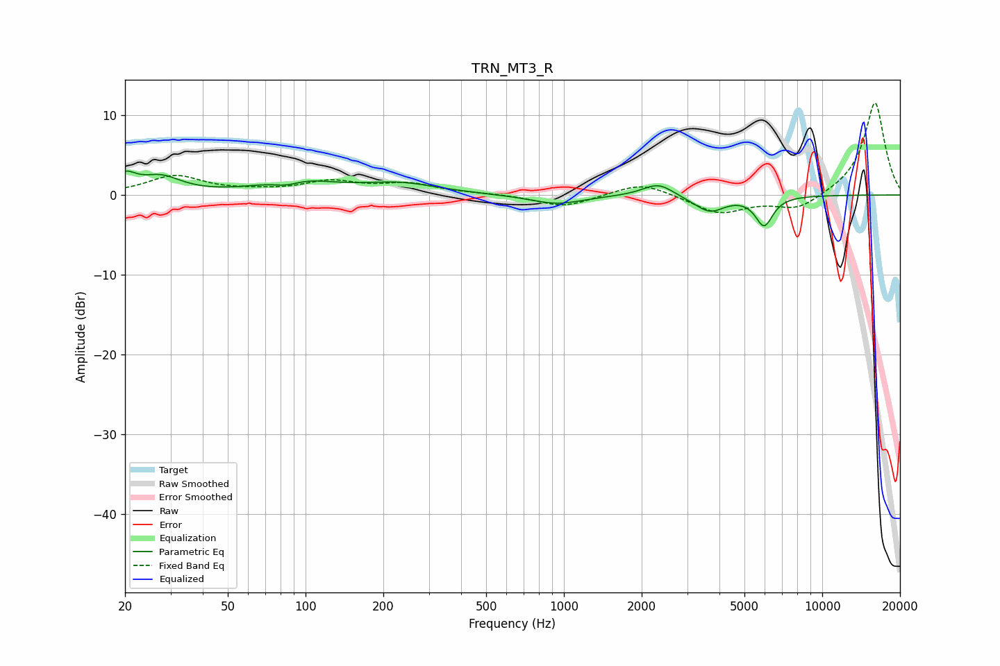

# TRN_MT3_R
See [usage instructions](https://github.com/jaakkopasanen/AutoEq#usage) for more options and info.

### Parametric EQs
Apply preamp of -3.1 dB when using parametric equalizer.

|   # | Type    |   Fc (Hz) |    Q |   Gain (dB) |
|-----|---------|-----------|------|-------------|
|   1 | Peaking |        20 | 3.45 |         2   |
|   2 | Peaking |        28 | 1.81 |         2   |
|   3 | Peaking |        85 | 2.51 |        -0.9 |
|   4 | Peaking |        91 | 1.07 |         1.9 |
|   5 | Peaking |       231 | 0.94 |         1.3 |
|   6 | Peaking |       938 | 1.36 |        -1.2 |
|   7 | Peaking |      2317 | 2.36 |         1.7 |
|   8 | Peaking |      3320 | 2.05 |        -0.5 |
|   9 | Peaking |      3707 | 2.59 |        -1.7 |
|  10 | Peaking |      5958 | 4.08 |        -3.7 |

### Fixed Band EQs
When using fixed band (also called graphic) equalizer, apply preamp of **-11.6 dB** (if available) and set gains manually with these parameters.

|   # | Type    |   Fc (Hz) |    Q |   Gain (dB) |
|-----|---------|-----------|------|-------------|
|   1 | Peaking |        31 | 1.41 |         2.3 |
|   2 | Peaking |        62 | 1.41 |         0.3 |
|   3 | Peaking |       125 | 1.41 |         1.5 |
|   4 | Peaking |       250 | 1.41 |         1.3 |
|   5 | Peaking |       500 | 1.41 |         0.1 |
|   6 | Peaking |      1000 | 1.41 |        -1.5 |
|   7 | Peaking |      2000 | 1.41 |         1.7 |
|   8 | Peaking |      4000 | 1.41 |        -2.3 |
|   9 | Peaking |      8000 | 1.41 |        -1.9 |
|  10 | Peaking |     16000 | 1.41 |        11.7 |

### Graphs

